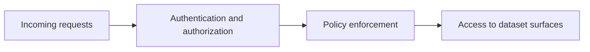
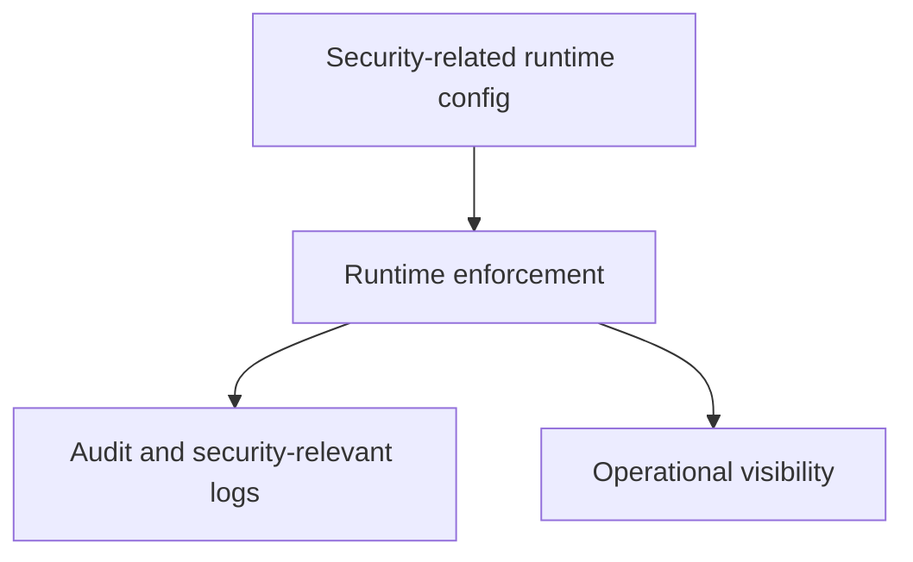

# Security Operations

Security operations in Atlas are about making runtime boundaries, authentication behavior, and sensitive data handling explicit and reviewable.

## Security Surface

This security surface diagram keeps request handling honest. Security decisions happen before access
to dataset surfaces, and they should be explainable from explicit runtime behavior rather than
deployment folklore.

## Security Operations Model

This operations model shows that security is not just about accepting or rejecting requests. It also
depends on configuration clarity, auditability, and the ability to observe the runtime safely.

## Operator Priorities

- understand which routes are intentionally exempt from auth
- understand how boundary identity headers are expected in proxied modes
- review policy and runtime config together, not in isolation
- treat logs and traces as part of security investigation, not only uptime investigation

## Practical Advice

- use explicit runtime configuration for security-sensitive behavior
- avoid undocumented assumptions about reverse proxies or header injection
- verify health routes and protected routes separately
- preserve auditability when diagnosing incidents

## Useful Security Checks

- confirm which routes are intentionally unauthenticated
- confirm which headers or proxy assumptions are required in your environment
- confirm that security-relevant logs are present before an incident happens

## Purpose

This page explains the Atlas material for security operations and points readers to the canonical checked-in workflow or boundary for this topic.

## Stability

This page is part of the canonical Atlas docs spine. Keep it aligned with the current repository behavior and adjacent contract pages.
