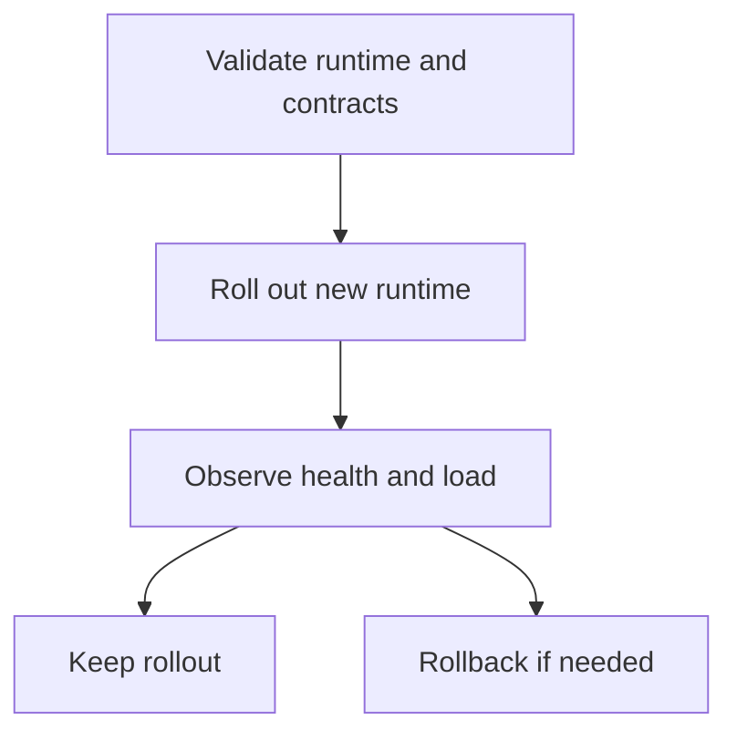
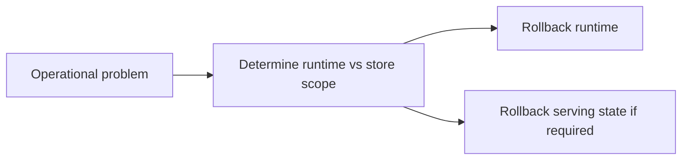

# Upgrades and Rollback

Atlas upgrades should preserve two invariants:

- contract-owned surfaces remain understood and validated
- serving state stays recoverable if a rollout goes wrong

## Upgrade Flow

## Rollback Flow

## Operator Guidance

- separate runtime rollback from store-state rollback in your thinking
- verify health, readiness, and key query paths after rollout
- keep rollback paths explicit before you need them
- use compatibility and contract evidence as rollout input, not only hope and manual spot checks

## What to Watch During Upgrade

- readiness instability
- unusual rejection or error patterns
- metrics or traces indicating saturation changes
- catalog or dataset discoverability regressions

## Purpose

This page explains the Atlas material for upgrades and rollback and points readers to the canonical checked-in workflow or boundary for this topic.

## Stability

This page is part of the canonical Atlas docs spine. Keep it aligned with the current repository behavior and adjacent contract pages.
