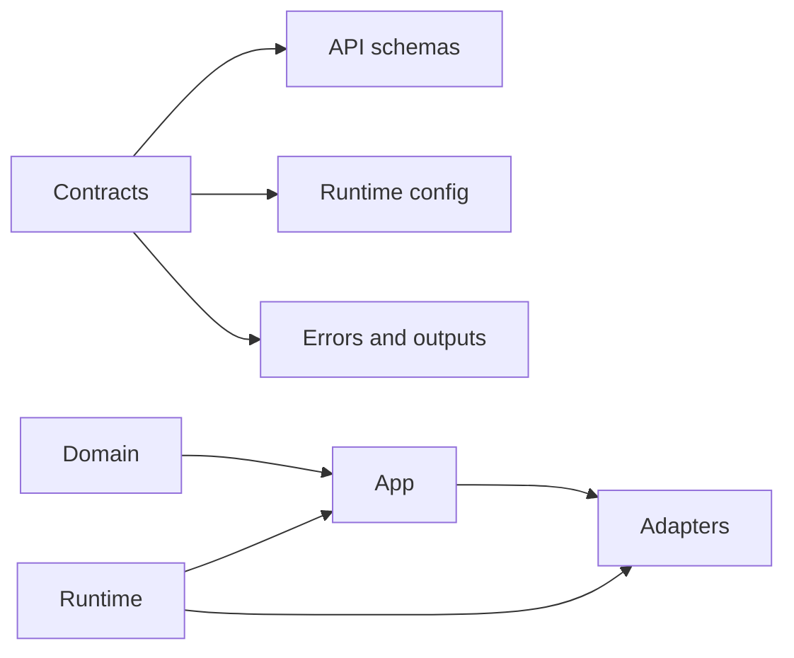
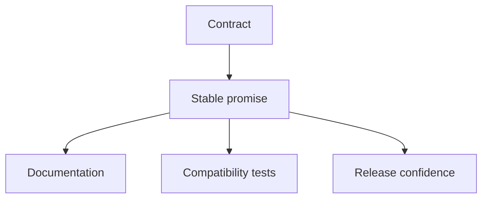

# Contracts and Boundaries

Atlas relies on boundaries to keep the codebase teachable and contracts to keep stable promises explicit.

## Boundary Model

## Contract Purpose

## The Main Architectural Idea

Boundaries decide where code should live.

Contracts decide what the outside world can rely on.

Those are related, but they are not the same thing.

## Typical Failure Modes

- duplicated contract ownership
- broad barrels hiding the real source of truth
- runtime or adapter logic bleeding into domain surfaces
- undocumented helper paths becoming accidental API

## Healthy Boundary Behavior

- ownership is obvious from the tree
- contracts have one owner path
- compatibility is test-backed
- internal refactors do not quietly redefine public promises

## Purpose

This page explains the Atlas material for contracts and boundaries and points readers to the canonical checked-in workflow or boundary for this topic.

## Stability

This page is part of the canonical Atlas docs spine. Keep it aligned with the current repository behavior and adjacent contract pages.
