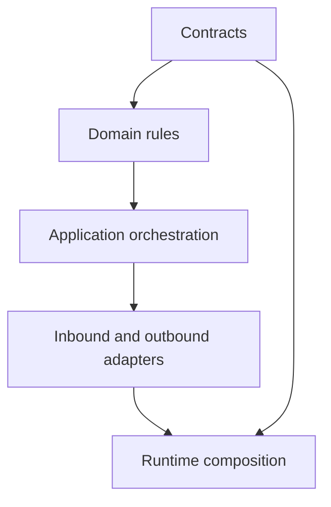
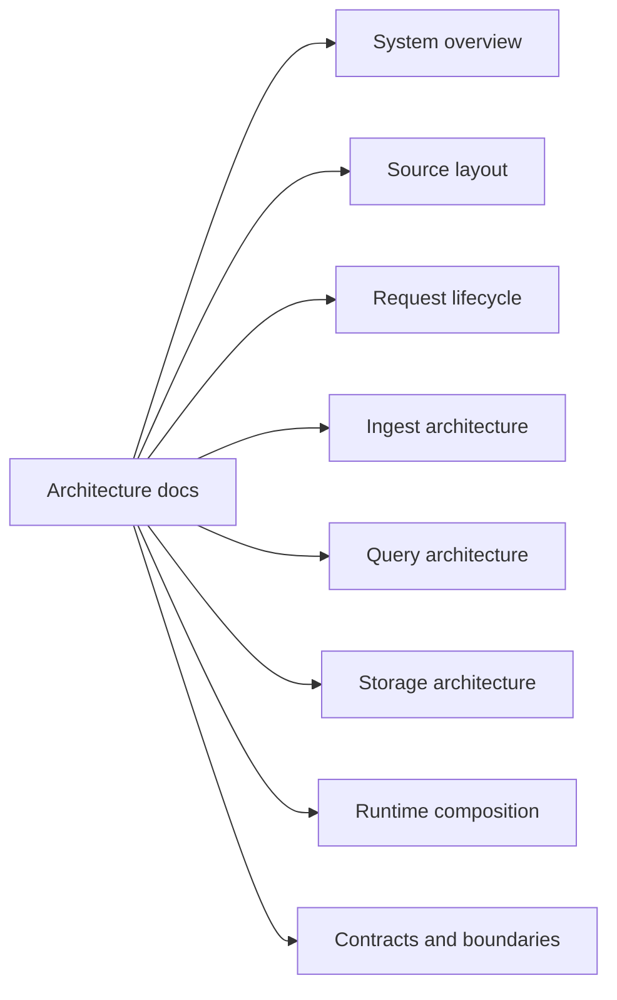

# Architecture

This section explains why Atlas is shaped the way it is and how the main runtime and data flows fit together.

Use this section when you need to understand:

- where code should live
- how requests and data move through the system
- what the runtime composes
- how contracts, ports, and adapters divide responsibility

This diagram names the architectural layers readers will see across the codebase. It makes clear
that contracts shape both the domain and the runtime, rather than living as an afterthought.

This map helps maintainers pick the right architecture page for the question they are trying to
answer. That keeps readers from treating one overview page as a substitute for the whole section.

## When to Prefer This Section

- you are deciding where code should live
- you need to understand why a boundary exists
- you are reviewing a design or refactor rather than running a workflow

## Pages in This Section

- [System Overview](system-overview.md)
- [Source Layout and Ownership](source-layout-and-ownership.md)
- [Automation Architecture](automation-architecture.md)
- [Request Lifecycle](request-lifecycle.md)
- [Ingest Architecture](ingest-architecture.md)
- [Query Architecture](query-architecture.md)
- [Storage Architecture](storage-architecture.md)
- [Runtime Composition](runtime-composition.md)
- [Contracts and Boundaries](contracts-and-boundaries.md)

## Purpose

This page explains the Atlas material for architecture and points readers to the canonical checked-in workflow or boundary for this topic.

## Stability

This page is part of the canonical Atlas docs spine. Keep it aligned with the current repository behavior and adjacent contract pages.
