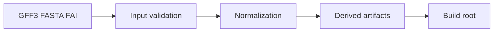
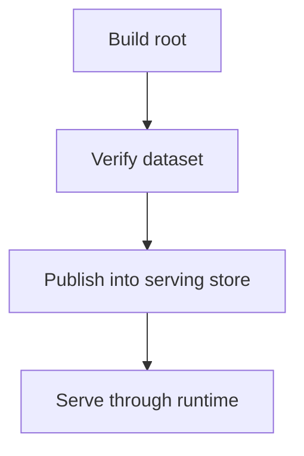

# Ingest Architecture

Ingest is the architectural boundary between raw source inputs and validated Atlas build state.

## Ingest Pipeline

## Architectural Outcome

## Why Ingest Stops at a Build Root

Atlas deliberately avoids making ingest directly equal to serving state. That separation enables:

- publication gates
- deterministic validation and verification
- explicit promotion into serving state

## What the Ingest Layer Owns

- input parsing and validation
- normalization and anomaly reporting
- derived artifacts such as manifests and SQLite summaries

It does not own:

- catalog discoverability
- runtime serving policy
- long-lived cache behavior

## Purpose

This page explains the Atlas material for ingest architecture and points readers to the canonical checked-in workflow or boundary for this topic.

## Stability

This page is part of the canonical Atlas docs spine. Keep it aligned with the current repository behavior and adjacent contract pages.
