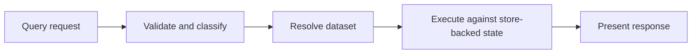
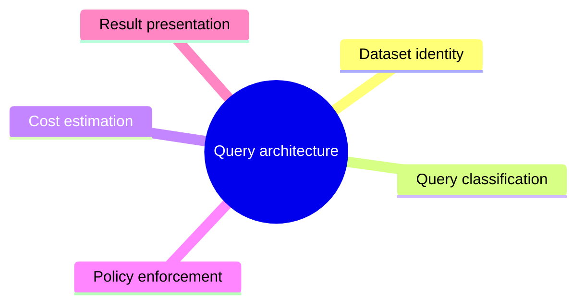

# Query Architecture

Atlas query architecture is shaped around explicit dataset identity, request classification, policy checks, and store-backed execution.

## Query Path

## Query Concerns

## Architectural Priorities

- explicit selectors beat implicit scans
- policy should explain rejection clearly
- response structure should remain deterministic
- query logic should not leak transport concerns into domain rules

## Why Query Validation Exists

The dedicated validation route is not just a convenience. It exposes the classification and policy model directly so clients can understand request shape without needing to infer behavior from full execution only.

