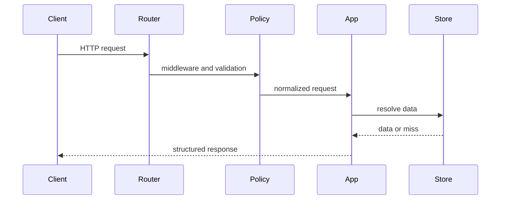
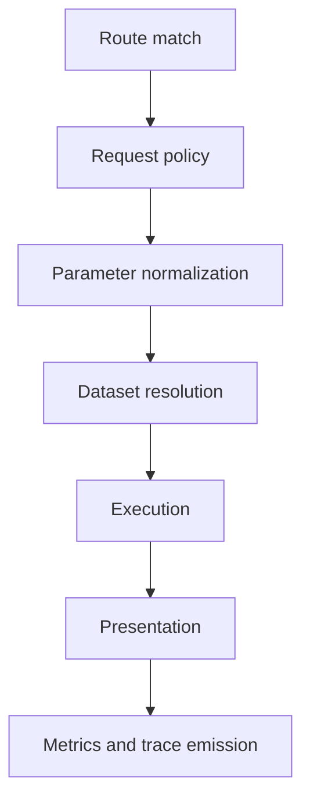

# Request Lifecycle

The request lifecycle explains what happens between an incoming HTTP request and a structured Atlas response.

## Lifecycle Overview

This lifecycle sequence keeps the request path concrete. It shows that policy, normalization,
dataset resolution, execution, and presentation are distinct stages rather than one opaque handler.

## Main Request Stages

This stage map is useful when debugging or refactoring. If you know which stage is wrong, you can
usually find the owning code and the right test surface much faster.

## Key Architectural Point

The router should remain declarative. Request shaping, policy enforcement, execution, and presentation each have different reasons to change.

## Why Operators and Maintainers Care

- request policy explains many 4xx responses
- dataset resolution explains many serving misses
- presentation explains why structured output looks the way it does
- metrics and tracing explain what happened after the fact

## A Healthy Request Boundary

- routers stay declarative
- policy explains many rejections before execution begins
- presentation shapes the response without redefining domain meaning

## Purpose

This page explains the Atlas material for request lifecycle and points readers to the canonical checked-in workflow or boundary for this topic.

## Stability

This page is part of the canonical Atlas docs spine. Keep it aligned with the current repository behavior and adjacent contract pages.
