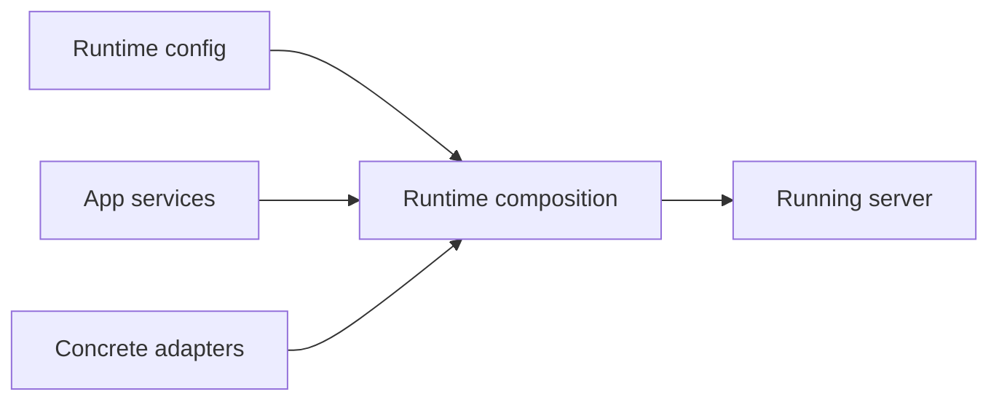
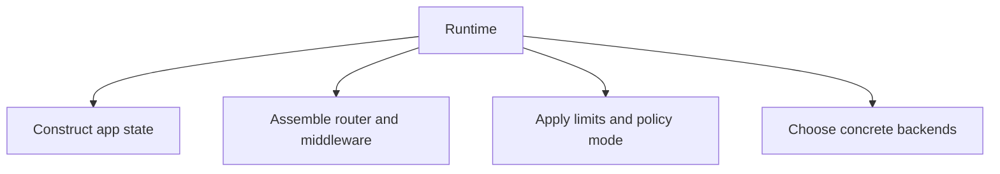

# Runtime Composition

Runtime composition is the process of turning Atlas modules into a running server process with concrete configuration, limits, backends, and middleware.

## Composition Model

## Runtime Responsibilities

## Architectural Boundary

Runtime is where concrete choices belong:

- addresses and bind settings
- store and cache roots
- concurrency and rate-limiting settings
- telemetry backends

Those choices should not leak backward and become domain rules.

## Purpose

This page explains the Atlas material for runtime composition and points readers to the canonical checked-in workflow or boundary for this topic.

## Stability

This page is part of the canonical Atlas docs spine. Keep it aligned with the current repository behavior and adjacent contract pages.
