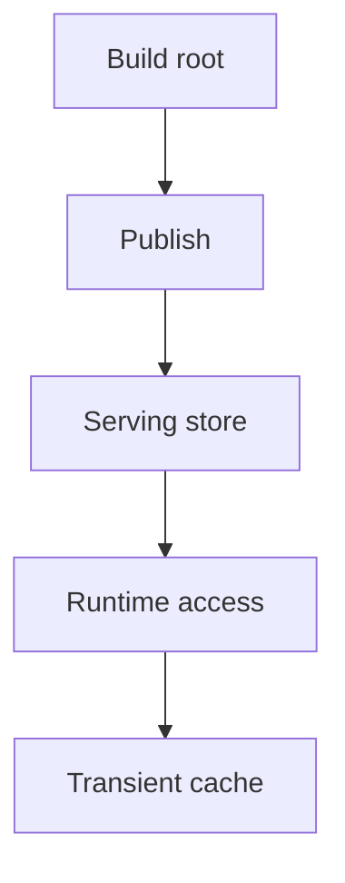
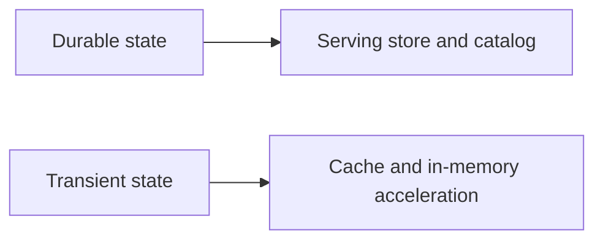

# Storage Architecture

Storage architecture in Atlas separates build output, serving store state, and transient runtime cache behavior.

## Storage Layers

## Durable vs Transient

## Architectural Rules

- build roots are validated outputs, not serving truth
- serving stores hold published artifacts and catalog state
- caches accelerate reads but do not redefine durable truth

## Why This Separation Matters

Without these storage boundaries, it becomes too easy to:

- point the runtime at the wrong directory
- confuse publication state with build state
- debug cache symptoms as if they were store corruption

