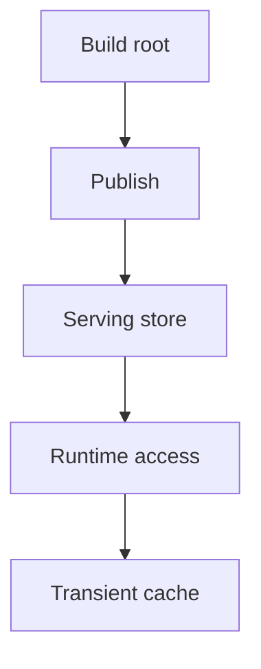
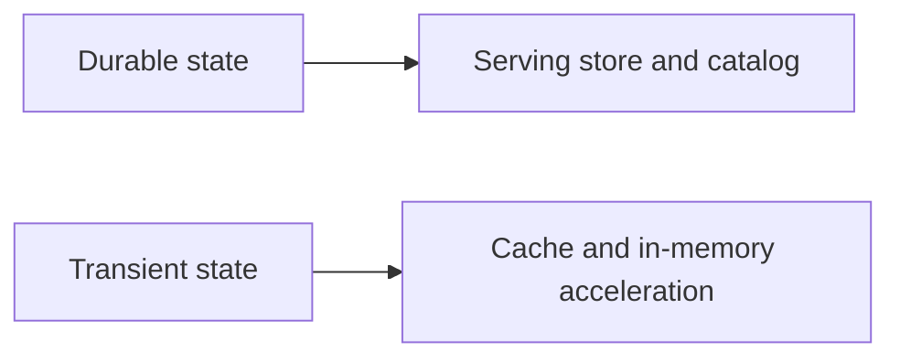

# Storage Architecture

Storage architecture in Atlas separates build output, serving store state, and transient runtime cache behavior.

## Storage Layers

This storage-layer diagram shows the order Atlas expects operators and maintainers to preserve. The
runtime reads published store state, and the cache sits downstream as acceleration rather than as a
second source of truth.

## Durable vs Transient

This durable-versus-transient split is worth making explicit because storage bugs become much easier
to classify when everyone uses the same boundary language.

## Architectural Rules

- build roots are validated outputs, not serving truth
- serving stores hold published artifacts and catalog state
- caches accelerate reads but do not redefine durable truth

## Why This Separation Matters

Without these storage boundaries, it becomes too easy to:

- point the runtime at the wrong directory
- confuse publication state with build state
- debug cache symptoms as if they were store corruption

## A Storage Question Worth Asking

When a storage-related issue appears, ask first whether the problem is in build output, serving
store state, catalog discoverability, or cache behavior. Those are different failure classes.

## Purpose

This page explains the Atlas material for storage architecture and points readers to the canonical checked-in workflow or boundary for this topic.

## Stability

This page is part of the canonical Atlas docs spine. Keep it aligned with the current repository behavior and adjacent contract pages.
