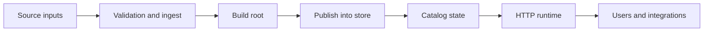
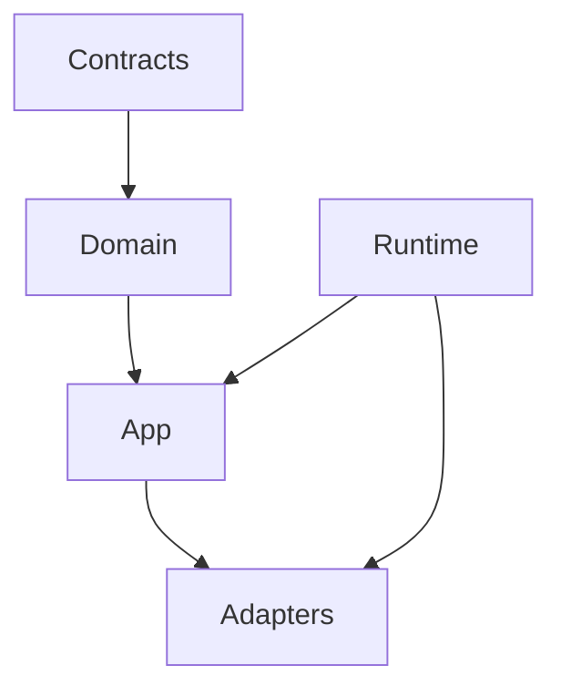

# System Overview

Atlas is a system for turning explicit source inputs into immutable release artifacts and serving those artifacts through stable runtime surfaces.

## End-to-End System View

## Main Architectural Zones

## Design Intent

The architecture tries to keep these responsibilities separate:

- domain defines business rules and data semantics
- app orchestrates use cases and ports
- adapters translate between the app and external systems
- runtime composes the real process
- contracts define the stable external shapes

## Why This Matters

Atlas becomes hard to maintain when:

- runtime wiring leaks into domain logic
- adapter concerns are treated as application truth
- contracts are duplicated across multiple roots

The architecture is designed to make those mistakes more visible and less normal.

