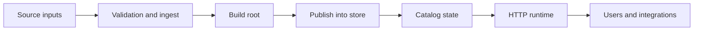
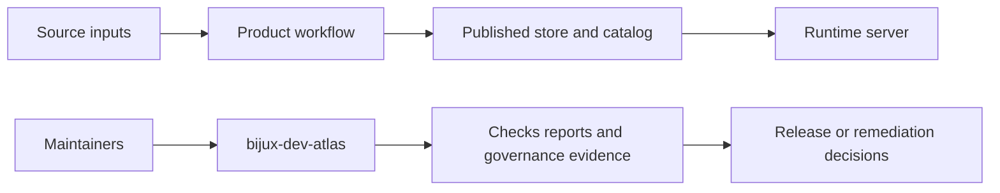
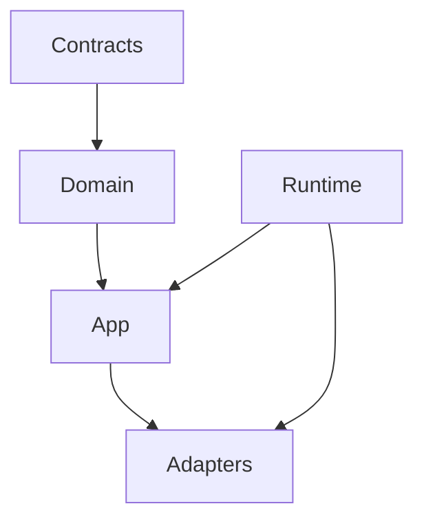

# System Overview

Atlas is a system for turning explicit source inputs into immutable release artifacts and serving those artifacts through stable runtime surfaces.

## End-to-End System View

This is the product path. It explains how data becomes serveable. It does not mean Atlas is only a server.

## The Two Systems Atlas Actually Has

This second system view matters because Atlas has both a product runtime and a maintainer control
plane. The architecture works best when those systems meet through artifacts, contracts, and
evidence instead of through hidden cross-dependencies.

Atlas is really two related systems:

- the product system that validates, publishes, and serves dataset state
- the maintainer control plane that validates repository rules, docs, contracts, and release evidence

Those systems should meet at contracts and artifacts, not leak into each other as hidden shared behavior.

## Main Architectural Zones

This zone diagram gives maintainers the mental map for the main source roots. It is intentionally
simple because the deeper pages in this section explain each zone in more detail.

## Design Intent

The architecture tries to keep these responsibilities separate:

- domain defines business rules and data semantics
- app orchestrates use cases and ports
- adapters translate between the app and external systems
- runtime composes the real process
- contracts define the stable external shapes

The repository also keeps a separate maintainer path:

- `bijux-atlas` and `bijux-atlas-server` are the user and operator-facing runtime surface
- `bijux-dev-atlas` is the maintainer-facing control plane
- the maintainer control plane may depend on runtime contracts, but the runtime should not depend on repo-governance behavior

## Why This Matters

Atlas becomes hard to maintain when:

- runtime wiring leaks into domain logic
- adapter concerns are treated as application truth
- contracts are duplicated across multiple roots
- repository diagnostics start distorting the user-facing runtime

The architecture is designed to make those mistakes more visible and less normal.

## What This Overview Should Leave You With

- Atlas turns source inputs into published serving state through explicit boundaries.
- The runtime surface and the maintainer control plane are related but intentionally different.
- Domain, app, adapters, runtime, and contracts each have a distinct reason to exist.

## Honest Simplification

This page is intentionally high-level. It tells you which boundaries matter most. For crate layout and control-plane structure, keep reading:

- [Source Layout and Ownership](source-layout-and-ownership.md)
- [Automation Architecture](automation-architecture.md)

## Purpose

This page explains the Atlas material for system overview and points readers to the canonical checked-in workflow or boundary for this topic.

## Stability

This page is part of the canonical Atlas docs spine. Keep it aligned with the current repository behavior and adjacent contract pages.
