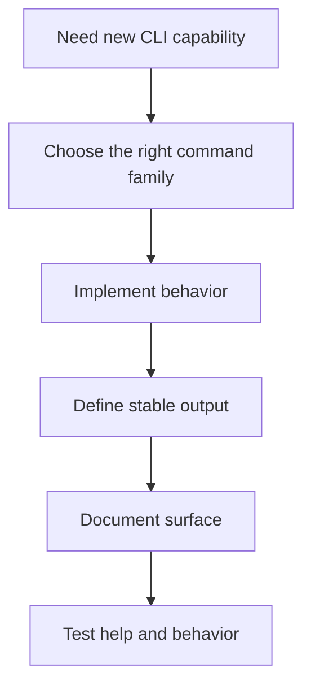
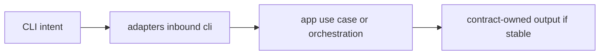

# Adding CLI Surface

New CLI surface should feel like it belongs to Atlas, not like a side entrance.

## CLI Addition Flow

This CLI addition flow keeps maintainers from treating new commands as isolated parser work. A new
CLI surface changes behavior, output, docs, and tests together.

## Placement Model

This placement model explains where CLI-specific concerns should stop. Parsing belongs in inbound
adapters, while reusable logic should move deeper into app or domain layers.

## Rules

- prefer extending the right command family over inventing a new miscellaneous root
- keep CLI parsing in inbound CLI adapters
- move reusable behavior into app or domain code when appropriate
- document stable output behavior if users or automation will depend on it

## CLI Surface Check Before Merge

- does the command belong in an existing family?
- does help output still tell an honest story?
- is any stable output now contract-worthy?

## Purpose

This page explains the Atlas material for adding cli surface and points readers to the canonical checked-in workflow or boundary for this topic.

## Stability

This page is part of the canonical Atlas docs spine. Keep it aligned with the current repository behavior and adjacent contract pages.
