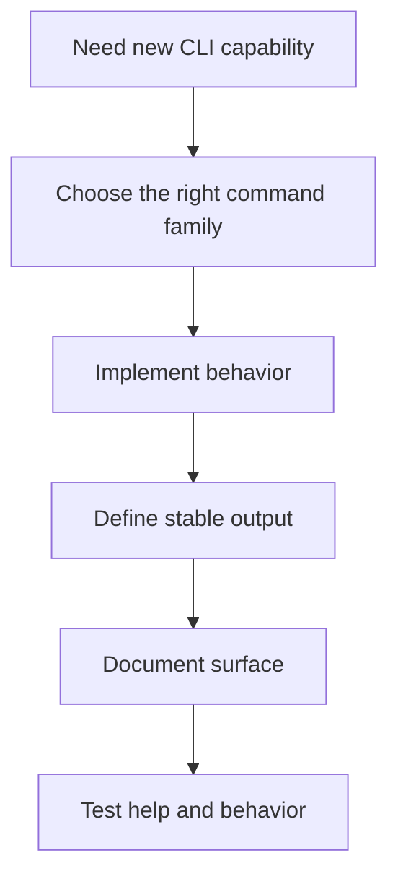
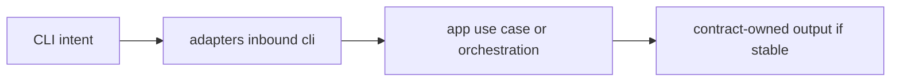

# Adding CLI Surface

New CLI surface should feel like it belongs to Atlas, not like a side entrance.

## CLI Addition Flow

## Placement Model

## Rules

- prefer extending the right command family over inventing a new miscellaneous root
- keep CLI parsing in inbound CLI adapters
- move reusable behavior into app or domain code when appropriate
- document stable output behavior if users or automation will depend on it

## Purpose

This page explains the Atlas material for adding cli surface and points readers to the canonical checked-in workflow or boundary for this topic.

## Stability

This page is part of the canonical Atlas docs spine. Keep it aligned with the current repository behavior and adjacent contract pages.
