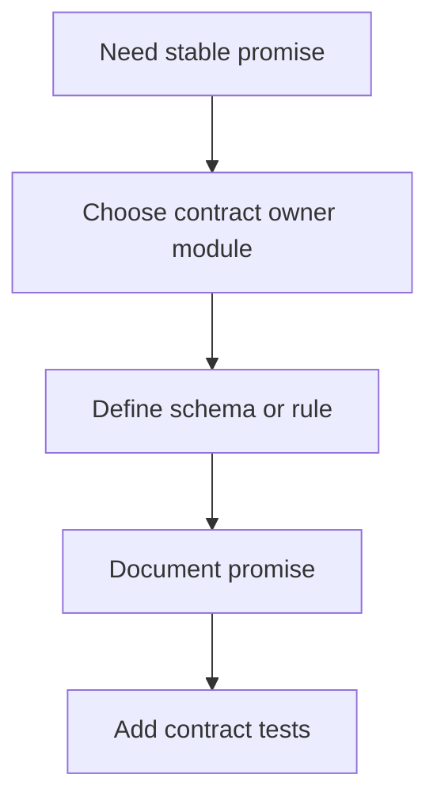
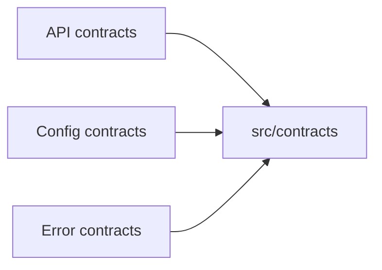

# Adding Contracts

Contracts are how Atlas turns intent into a stable, reviewable promise.

## Contract Addition Flow

This contract-addition flow keeps “we should probably promise this” from staying vague. A real
contract needs an owner, a definition, documentation, and tests that can fail when the promise
drifts.

## Ownership Model

This ownership model makes the contract home explicit. Atlas tries to give each stable promise one
obvious owner path so refactors do not create duplicate sources of truth.

## Rules

- give each contract one obvious owner path
- document the promise and its intended audience
- add tests that would fail if the promise drifts
- do not hide contract truth behind convenience reexports

## Contract Addition Check

- who relies on this promise?
- where is the one owning source?
- what test will fail if the promise changes accidentally?

## Purpose

This page explains the Atlas material for adding contracts and points readers to the canonical checked-in workflow or boundary for this topic.

## Stability

This page is part of the canonical Atlas docs spine. Keep it aligned with the current repository behavior and adjacent contract pages.
