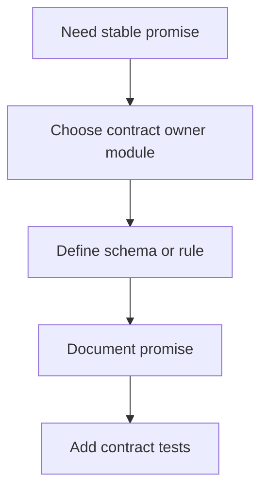
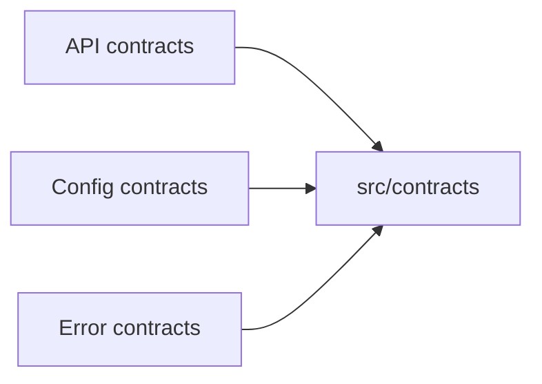

# Adding Contracts

Contracts are how Atlas turns intent into a stable, reviewable promise.

## Contract Addition Flow

## Ownership Model

## Rules

- give each contract one obvious owner path
- document the promise and its intended audience
- add tests that would fail if the promise drifts
- do not hide contract truth behind convenience reexports

