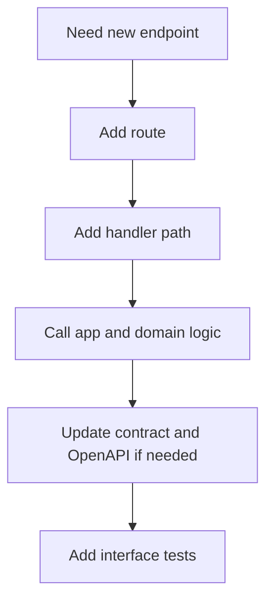
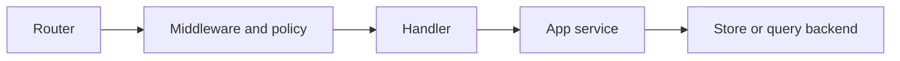

# Adding HTTP Surface

New HTTP surface should preserve the separation between routing, policy, execution, and presentation.

## HTTP Addition Flow

## Layering Model

## Rules

- keep router declarations declarative
- keep HTTP concerns in HTTP adapters
- avoid letting HTTP types become application truth
- update documentation and contracts when the surface is stable or public

