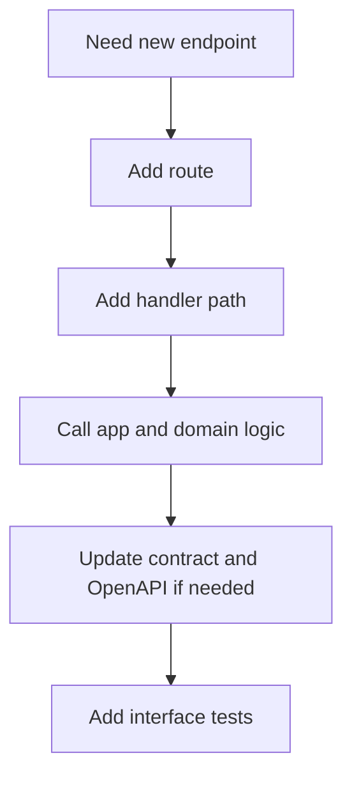
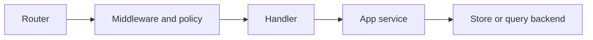

# Adding HTTP Surface

New HTTP surface should preserve the separation between routing, policy, execution, and presentation.

## HTTP Addition Flow

This HTTP addition flow shows the full change path for a new endpoint. Routing, handler logic,
contracts, docs, and tests all move together when the surface is real.

## Layering Model

This layering model keeps transport concerns from spreading too far inward. HTTP types and routing
rules should not quietly become application truth.

## Rules

- keep router declarations declarative
- keep HTTP concerns in HTTP adapters
- avoid letting HTTP types become application truth
- update documentation and contracts when the surface is stable or public

## HTTP Surface Check Before Merge

- does the router stay declarative?
- is policy enforcement still visible and testable?
- did OpenAPI and interface tests move with the new route?

## Purpose

This page explains the Atlas material for adding http surface and points readers to the canonical checked-in workflow or boundary for this topic.

## Stability

This page is part of the canonical Atlas docs spine. Keep it aligned with the current repository behavior and adjacent contract pages.
