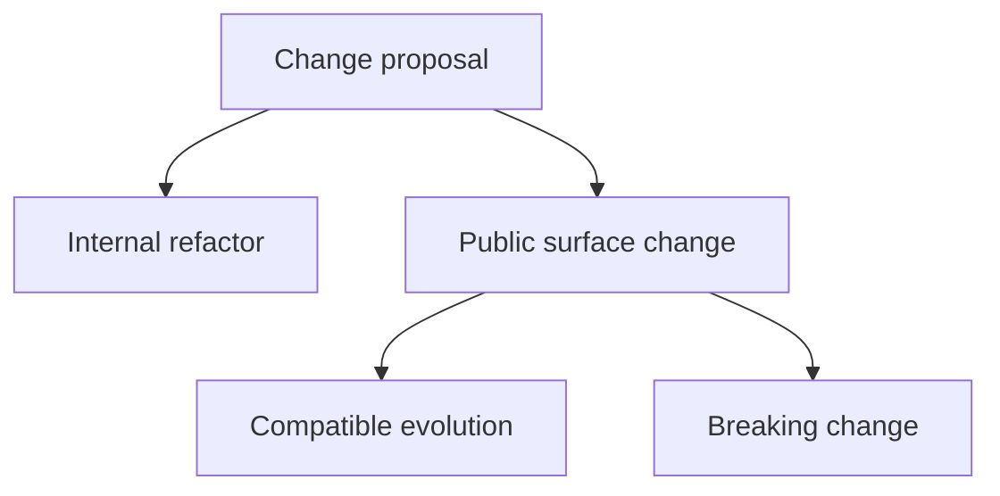
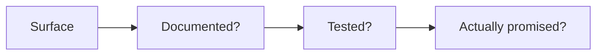

# Change and Compatibility

Atlas changes should be classified before they are implemented. That prevents accidental breaking changes from sneaking in under the label of simple refactoring.

## Change Classification

## Compatibility Questions

## Maintainer Checklist

- is this surface documented?
- is it contract-owned?
- do tests enforce the promise?
- does the change alter user, operator, or automation expectations?

## Rule of Thumb

If users, operators, or CI would notice the change without reading source code, treat it as a compatibility question first and an implementation question second.

