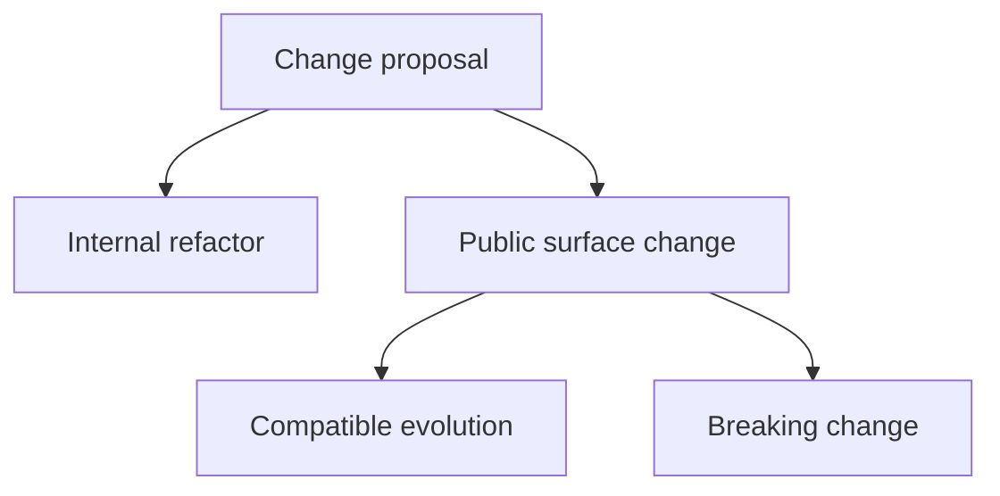
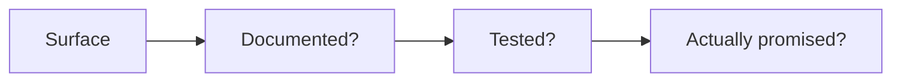

# Change and Compatibility

Atlas changes should be classified before they are implemented. That prevents accidental breaking changes from sneaking in under the label of simple refactoring.

## Change Classification

This classification diagram exists so compatibility thinking happens before implementation momentum
takes over. Atlas wants breaking and compatible changes to be intentional, not discovered late.

## Compatibility Questions

This compatibility-question chain is the quickest way to determine how seriously to treat a change.
If the surface is documented, tested, and promised, compatibility review is not optional.

## Maintainer Checklist

- is this surface documented?
- is it contract-owned?
- do tests enforce the promise?
- does the change alter user, operator, or automation expectations?

## Rule of Thumb

If users, operators, or CI would notice the change without reading source code, treat it as a compatibility question first and an implementation question second.

## A Useful Compatibility Habit

- classify the surface before coding
- say “internal,” “compatible,” or “breaking” explicitly in review language
- update docs and evidence in the same change when the answer is not purely internal

## Purpose

This page explains the Atlas material for change and compatibility and points readers to the canonical checked-in workflow or boundary for this topic.

## Stability

This page is part of the canonical Atlas docs spine. Keep it aligned with the current repository behavior and adjacent contract pages.
