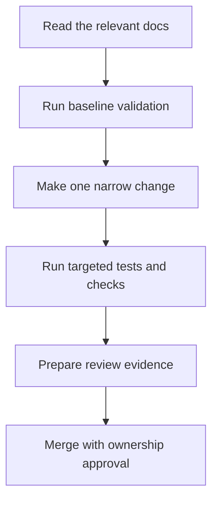

# Contributor Workflow

This page explains the expected path from a fresh checkout to a review-ready Atlas change.

## First Contribution Path



## Environment Baseline

Treat the workspace root as the only supported starting point.

```bash
cargo fetch
cargo test -p bijux-dev-atlas --no-run
cargo run -q -p bijux-dev-atlas -- governance validate --format json
cargo run -q -p bijux-dev-atlas -- check doctor --format json
```

If those commands fail, fix the environment first instead of trying to work around the failure in later steps.

## Recommended Onboarding Sequence

1. Read the product and architecture pages for the surface you plan to change.
2. Start with a docs-only or low-risk code change before touching contract-owned behavior.
3. Run the narrowest targeted validation that proves the change is correct.
4. Run the lane wrapper or suite that matches the review path before you ask for approval.

## Review Expectations

- make the scope and user-visible intent explicit
- call out compatibility or contract impact, even when the answer is "none"
- update tests, docs, and operational guidance together when behavior changes
- avoid hidden side effects, unreviewable wrappers, and silent output changes
- involve the owning domain when a change crosses crate, docs, or ops boundaries

## Pull Request Readiness

Before opening or updating a pull request, confirm:

- the branch contains one coherent story per commit
- the smallest relevant test or check set already passes locally
- the matching docs page is updated when public behavior changed
- evidence artifacts or JSON output are refreshed when review depends on them
- reviewers can reproduce the result with one copy-paste command

## Common Local Problems

If governance validation fails, re-run `cargo run -q -p bijux-dev-atlas -- governance check --format json` and fix the rule or file path named in the output.

If a control-plane command fails before doing useful work, inspect whether it needs explicit capability flags or an external tool that is only expected in broader lanes.

If CI fails but your narrow local check passes, reproduce the matching wrapper first, then narrow to the underlying command only after the lane itself is understood.

## Where to Go Next

- [Workspace and Tooling](workspace-and-tooling.md)
- [Automation Control Plane](automation-control-plane.md)
- [Testing and Evidence](testing-and-evidence.md)
- [Change and Compatibility](change-and-compatibility.md)

## Purpose

This page explains the Atlas material for contributor workflow and points readers to the canonical checked-in workflow or boundary for this topic.

## Stability

This page is part of the canonical Atlas docs spine. Keep it aligned with the current repository behavior and adjacent contract pages.
