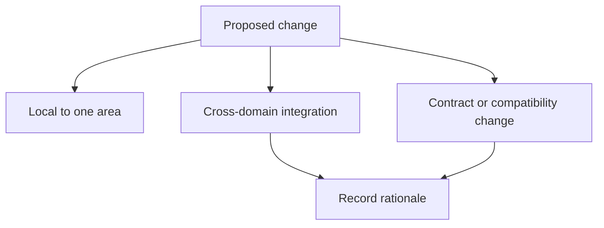

# Decision Records and Ownership

Atlas stays reviewable when ownership is explicit and non-local decisions are recorded where future maintainers can find them.

## Decision Classes



Use local judgment for isolated implementation work. When the change crosses domains or alters a
documented promise, capture the decision in a durable record instead of leaving it in chat or commit
lore.

## Ownership Signals

The most reliable ownership signals in this repository are:

- page-level `owner` metadata in canonical docs
- registry or schema ownership fields in `configs/`
- suite, report, and runnable ownership metadata emitted by `bijux-dev-atlas`
- repository review boundaries in `.github/CODEOWNERS`

If those signals disagree, resolve the ownership drift before merging the change.

## When to Record a Decision

Capture a durable decision record when you:

- change a contract, schema, or compatibility promise
- move a boundary between crates, domains, docs, configs, or ops
- introduce a new canonical automation surface or retire an old one
- change a workflow that other contributors will need to repeat

## Practical Commands

```bash
cargo run -q -p bijux-dev-atlas -- governance adr index --format json
cargo run -q -p bijux-dev-atlas -- governance list --format json
cargo run -q -p bijux-dev-atlas -- governance doctor --format json
```

Use these commands to inspect the current governance state before you add another layer of implied process.

## Maintainer Rule

Never rely on "the owner probably knows" or "the context is in the PR" as the only governance
mechanism. If future readers need the decision to understand why the repository is shaped this way,
record it in a canonical file.

## Purpose

This page explains the Atlas material for decision records and ownership and points readers to the canonical checked-in workflow or boundary for this topic.

## Stability

This page is part of the canonical Atlas docs spine. Keep it aligned with the current repository behavior and adjacent contract pages.
