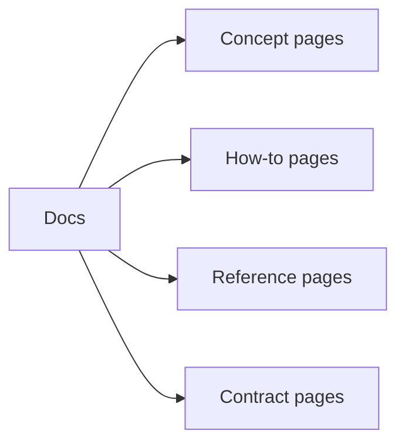
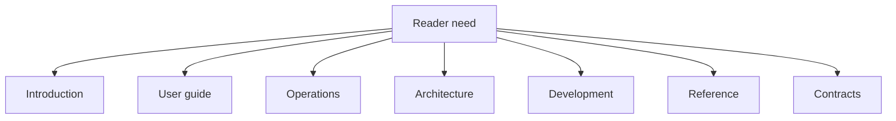

# Documentation Standards

Atlas documentation should make the right thing obvious and the wrong thing uncomfortable.

## Documentation Types

## Placement Rules

## Writing Rules

- one page should have one dominant purpose
- use diagrams when they clarify relationships or flow
- avoid mixing explanation, runbook, and contract language in one page
- prefer canonical paths and current ownership over historical naming
- prefer durable names over migration-era or time-boxed labels
- document the stable story, not accidental implementation trivia

## Source-of-Truth Rules

- one topic should have one canonical page in the reader-oriented spine
- reference material belongs in `07-reference`, not in ad hoc side directories
- generated artifacts may support docs, but they do not replace explanatory pages
- historical migration notes should either be absorbed into canonical docs or removed
- avoid archive-shaped duplication when the live docs already cover the behavior

## Review Standard

Before merging docs, ask:

- is the reader path obvious?
- is the source of truth obvious?
- is the page in the right section?
- would a pedantic reviewer know what this page is for immediately?

## Purpose

This page explains the Atlas material for documentation standards and points readers to the canonical checked-in workflow or boundary for this topic.

## Stability

This page is part of the canonical Atlas docs spine. Keep it aligned with the current repository behavior and adjacent contract pages.
