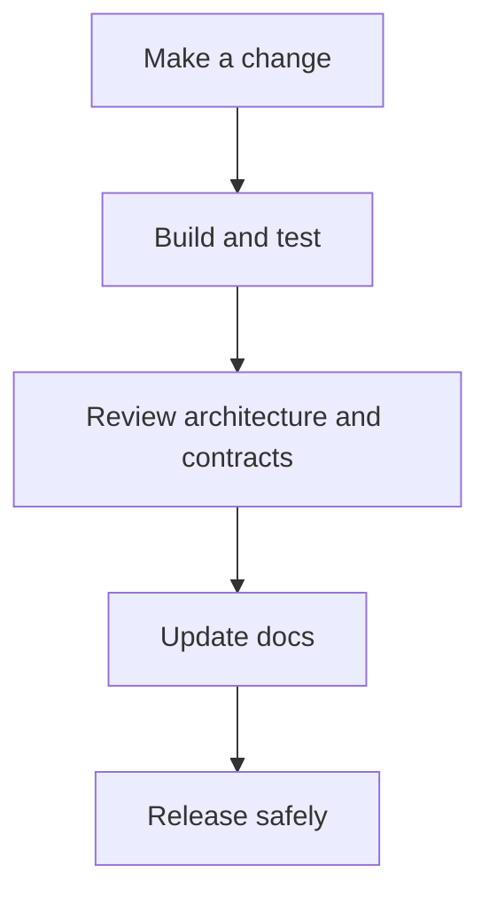
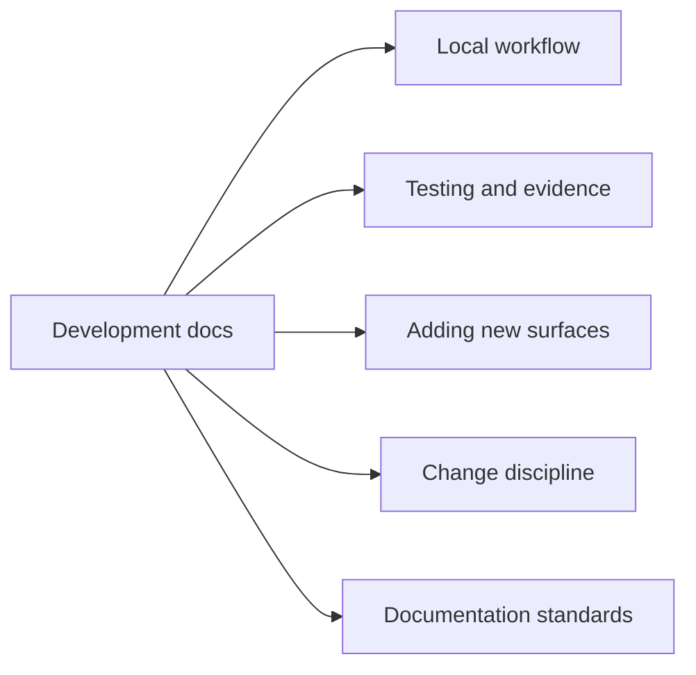

# Bijux Atlas Development

This section explains how to change Atlas safely.

The goal is not only to make local edits possible. The goal is to make those edits preserve:

- source-of-truth clarity
- compatibility expectations
- test evidence
- documentation quality

This change path shows the standard Atlas development loop. Code, proof, documentation, and release
discipline are expected to move together, not as separate cleanup steps.

This page map helps contributors find the owning guidance for the kind of change they are making.
That is especially useful in a repository where runtime code, automation, and docs are all governed
surfaces.

## Use This Section When

- you plan to change code, docs, governance inputs, or release automation
- you need to choose the right validation evidence
- you are preparing a reviewable branch and want the repository’s contribution rules in one place

## Pages in This Section

- [Workspace and Tooling](workspace-and-tooling.md)
- [Local Development](local-development.md)
- [Contributor Workflow](contributor-workflow.md)
- [Automation Control Plane](automation-control-plane.md)
- [Decision Records and Ownership](decision-records-and-ownership.md)
- [Testing and Evidence](testing-and-evidence.md)
- [Adding CLI Surface](adding-cli-surface.md)
- [Adding HTTP Surface](adding-http-surface.md)
- [Adding Contracts](adding-contracts.md)
- [Change and Compatibility](change-and-compatibility.md)
- [Release and Versioning](release-and-versioning.md)
- [Documentation Standards](documentation-standards.md)

## Purpose

This page explains the Atlas material for development and points readers to the canonical checked-in workflow or boundary for this topic.

## Stability

This page is part of the canonical Atlas docs spine. Keep it aligned with the current repository behavior and adjacent contract pages.
