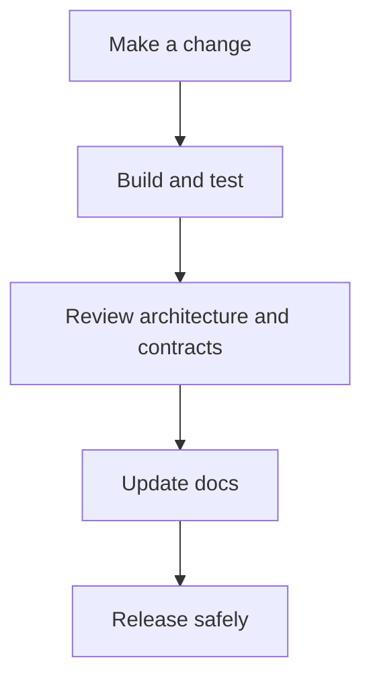
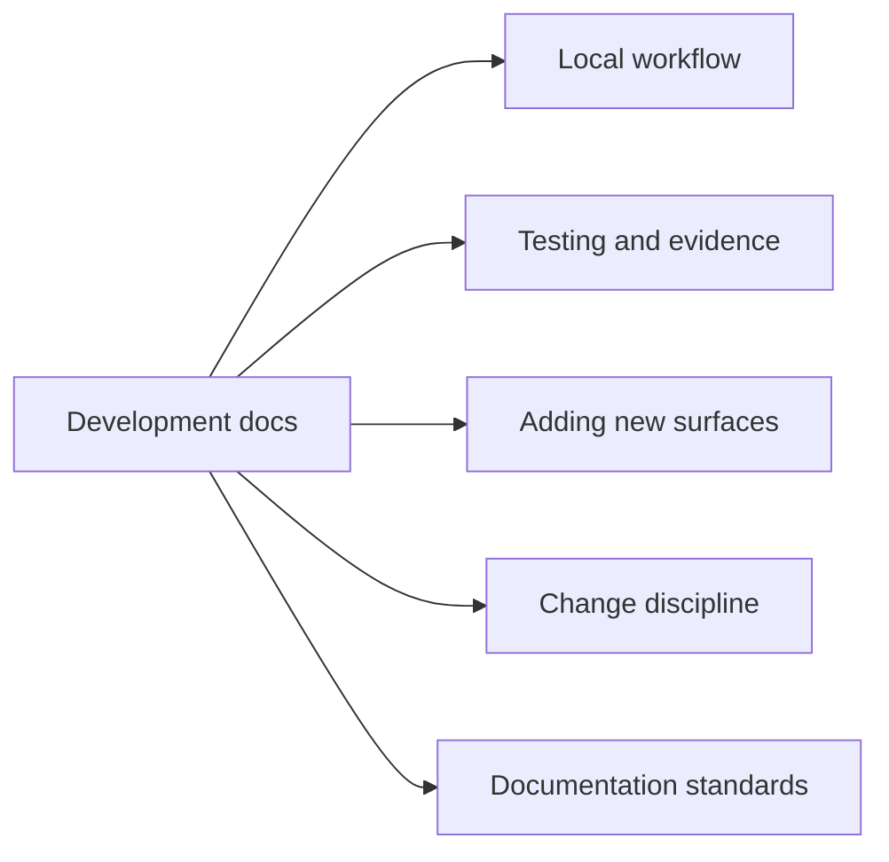

# Development

This section explains how to change Atlas safely.

The goal is not only to make local edits possible. The goal is to make those edits preserve:

- source-of-truth clarity
- compatibility expectations
- test evidence
- documentation quality

## Pages in This Section

- [Workspace and Tooling](workspace-and-tooling.md)
- [Local Development](local-development.md)
- [Contributor Workflow](contributor-workflow.md)
- [Automation Control Plane](automation-control-plane.md)
- [Decision Records and Ownership](decision-records-and-ownership.md)
- [Testing and Evidence](testing-and-evidence.md)
- [Adding CLI Surface](adding-cli-surface.md)
- [Adding HTTP Surface](adding-http-surface.md)
- [Adding Contracts](adding-contracts.md)
- [Change and Compatibility](change-and-compatibility.md)
- [Release and Versioning](release-and-versioning.md)
- [Documentation Standards](documentation-standards.md)

## Purpose

This page explains the Atlas material for development and points readers to the canonical checked-in workflow or boundary for this topic.

## Stability

This page is part of the canonical Atlas docs spine. Keep it aligned with the current repository behavior and adjacent contract pages.
