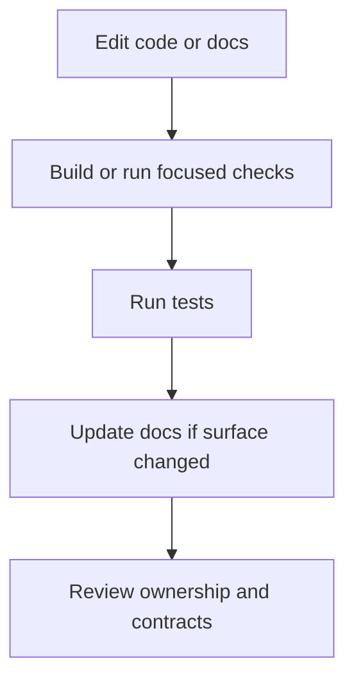
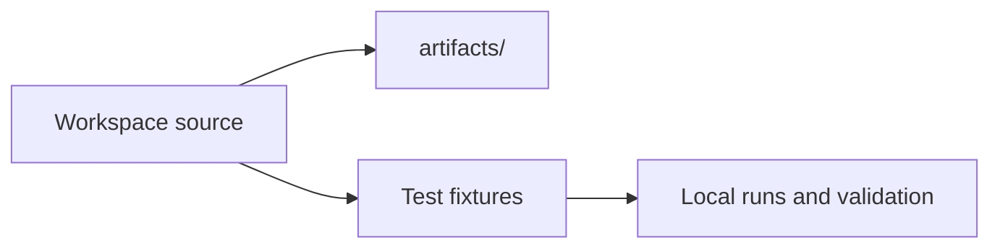

# Local Development

Local development should make it easy to iterate without teaching bad habits.

## Local Development Loop

## Local Environment Model

## Safe Local Habits

- keep local outputs in `artifacts/`
- use committed fixtures for reproducible local experiments
- validate the layer you changed instead of only running a giant command blindly
- preserve the canonical module ownership model when moving code

## Purpose

This page explains the Atlas material for local development and points readers to the canonical checked-in workflow or boundary for this topic.

## Stability

This page is part of the canonical Atlas docs spine. Keep it aligned with the current repository behavior and adjacent contract pages.
