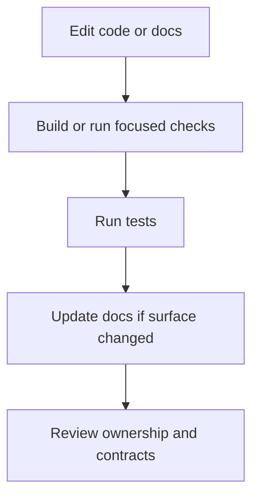
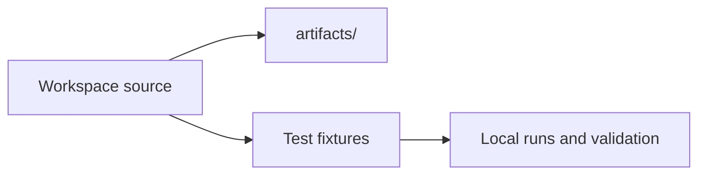

# Local Development

Local development should make it easy to iterate without teaching bad habits.

## Local Development Loop

This local loop is meant to build good habits early. Atlas changes are easier to review when code,
proof, and documentation move together instead of being cleaned up in separate passes later.

## Local Environment Model

This local environment model keeps experiments reproducible. Committed fixtures and disposable
artifacts make it easier to repeat a workflow and explain what happened.

## Safe Local Habits

- keep local outputs in `artifacts/`
- use committed fixtures for reproducible local experiments
- validate the layer you changed instead of only running a giant command blindly
- preserve the canonical module ownership model when moving code

## What Local Development Should Not Teach

- hiding outputs in crate-local scratch paths
- relying on undocumented environment quirks
- skipping docs or compatibility review until the end

## Purpose

This page explains the Atlas material for local development and points readers to the canonical checked-in workflow or boundary for this topic.

## Stability

This page is part of the canonical Atlas docs spine. Keep it aligned with the current repository behavior and adjacent contract pages.
