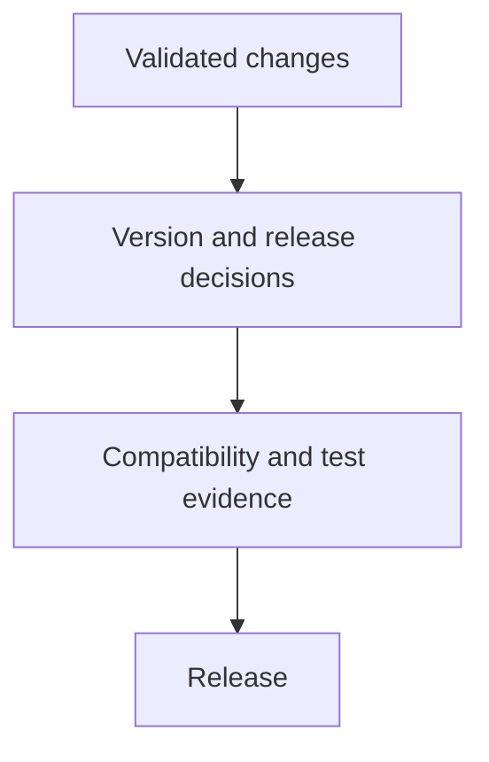
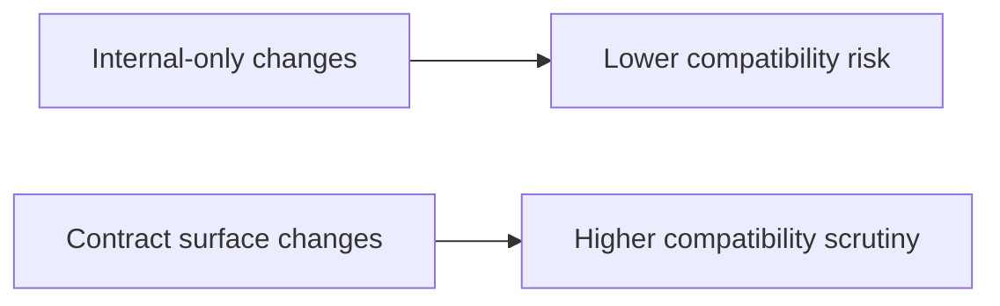

# Release and Versioning

Release work is where local correctness becomes public responsibility.

## Release Flow



## Versioning Model



## Maintainer Priorities

- understand which surfaces changed
- understand whether the change is compatible
- ensure release evidence matches the level of change

## Release Types

- planned release: normal delivery of accumulated compatible work
- patch release: correctness, regression, or security fixes with narrow scope
- emergency release: urgent mitigation for a high-severity incident or exploit

Each release type still needs explicit evidence. Urgency changes the path length, not the obligation to prove what shipped.

## Support and Deprecation Model

- the latest supported minor line receives normal maintenance
- the previous supported minor line is the fallback window for critical or security fixes
- older lines are unsupported unless the repository explicitly documents an extension

For deprecations:

1. introduce the replacement first
2. record the deprecation in `configs/sources/governance/governance/deprecations.yaml`
3. keep compatibility shims or redirects for the supported window
4. remove the deprecated surface only after the planned removal point and updated evidence

## Practical Governance Checks

Review deprecation entries in `configs/sources/governance/governance/deprecations.yaml` as part of release preparation, and use this command to inspect the broader governance state:

```bash
cargo run -q -p bijux-dev-atlas -- governance doctor --format json
```

## Practical Mindset

Release discipline is not only a packaging step. It is the final check that the documented story, tested story, and shipped story still match.
