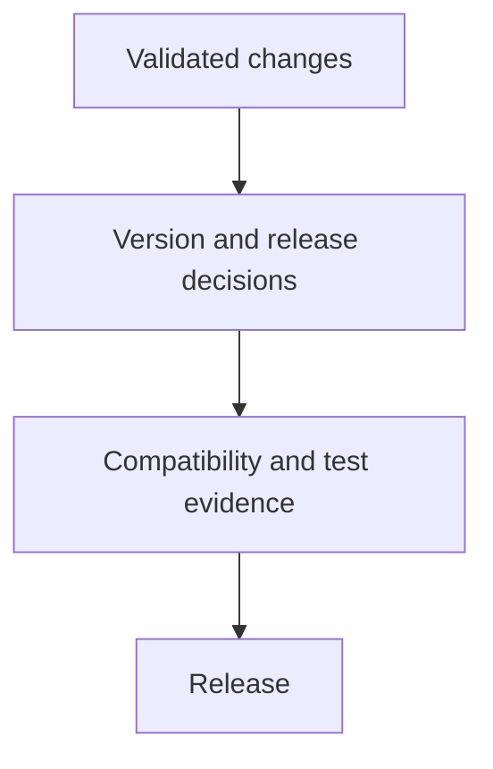
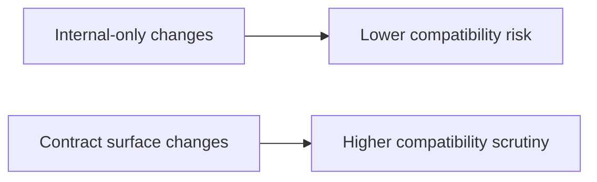

# Release and Versioning

Release work is where local correctness becomes public responsibility.

## Release Flow

## Versioning Model

## Maintainer Priorities

- understand which surfaces changed
- understand whether the change is compatible
- ensure release evidence matches the level of change

## Practical Mindset

Release discipline is not only a packaging step. It is the final check that the documented story, tested story, and shipped story still match.

