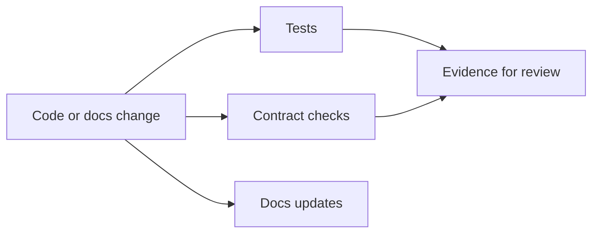
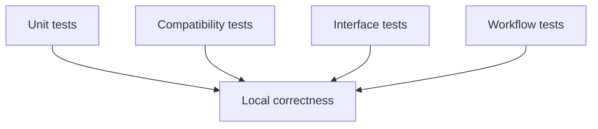

# Testing and Evidence

Atlas changes should be defended by evidence, not only by intuition.

## Evidence Model



This evidence model shows that Atlas review is not code-versus-tests alone. Docs, contract checks,
and explicit proof all contribute to the case that a change is safe.

## Test Shape



This test-shape diagram makes the testing stack easier to reason about. Different test classes answer
different questions, and the right mix depends on the surface you changed.

## Practical Commands

```bash
cargo test -p bijux-atlas
cargo test -p bijux-dev-atlas
cargo bench -p bijux-dev-atlas
cargo run -q -p bijux-dev-atlas -- perf run --scenario gene-lookup --format json
make test
```

## Evidence Quality Rules

- state exactly what failed or changed
- include one rerun command a reviewer can copy and paste
- name the artifact or report path when output matters
- prefer structured evidence when a lane already consumes JSON

## Performance and Benchmark Discipline

Performance evidence is part of the quality story when a change touches expensive paths, control-plane throughput, or report-heavy flows.

- keep benchmarks deterministic
- keep benchmark artifacts under approved workspace roots
- do not hide expensive validation behind fast local commands
- use broader lanes for slow or environment-sensitive evidence

## Cost Awareness

Fast feedback matters. Run the smallest targeted command that proves the change is safe, then escalate to broader suites only when the change scope requires it.

## Evidence Smell Test

- can a reviewer rerun the proof quickly?
- does the evidence match the surface that changed?
- is the output structured when the review path depends on structured evidence?

## Maintainer Rule

If you change a public or contract-owned surface, the test story should show why the change is safe or intentionally breaking.

## Purpose

This page explains the Atlas material for testing and evidence and points readers to the canonical checked-in workflow or boundary for this topic.

## Stability

This page is part of the canonical Atlas docs spine. Keep it aligned with the current repository behavior and adjacent contract pages.
