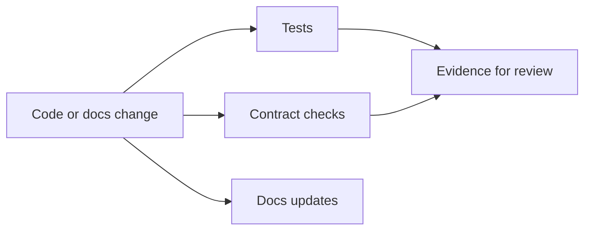
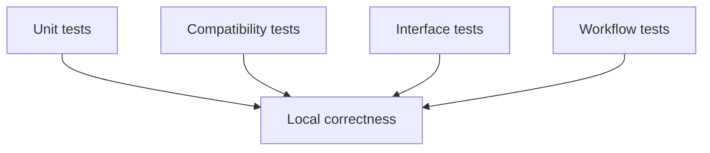

# Testing and Evidence

Atlas changes should be defended by evidence, not only by intuition.

## Evidence Model



## Test Shape



## Practical Commands

```bash
cargo test -p bijux-atlas
cargo test -p bijux-dev-atlas
make test
```

## Maintainer Rule

If you change a public or contract-owned surface, the test story should show why the change is safe or intentionally breaking.

