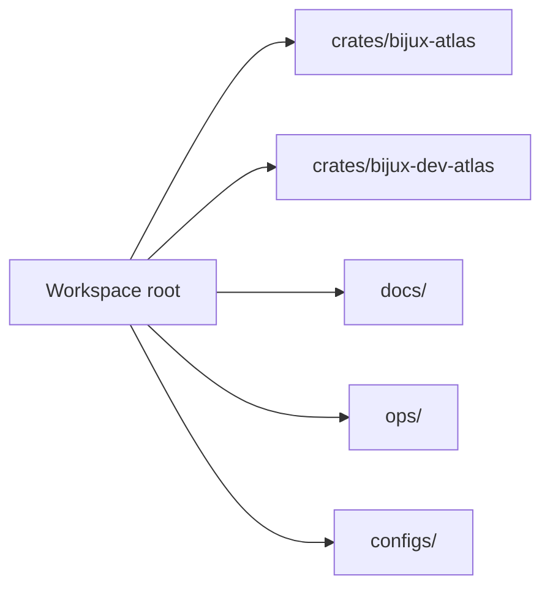
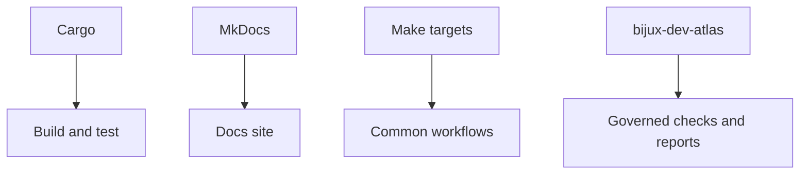

# Workspace and Tooling

Atlas lives in a multi-crate workspace. Development works best when you treat the workspace as the unit of truth, not only the single crate you happen to be editing.

## Workspace View

## Tooling View

## Practical Advice

- run commands from the workspace root
- treat `bijux-dev-atlas` as part of the development toolchain, not as a separate afterthought
- keep artifacts under `artifacts/`
- prefer explicit paths over current-directory assumptions

## Toolchain Baseline

The current workspace MSRV and pinned Rust toolchain are both `1.85.0`.

If `Cargo.toml`, `rust-toolchain.toml`, and release validation disagree about that version, treat it as a release blocker rather than a cosmetic drift.

## Purpose

This page explains the Atlas material for workspace and tooling and points readers to the canonical checked-in workflow or boundary for this topic.

## Stability

This page is part of the canonical Atlas docs spine. Keep it aligned with the current repository behavior and adjacent contract pages.
