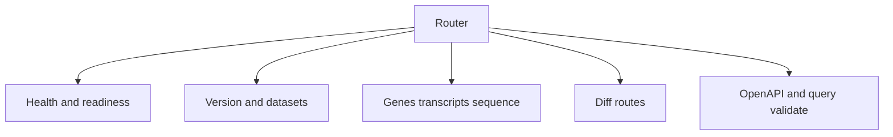
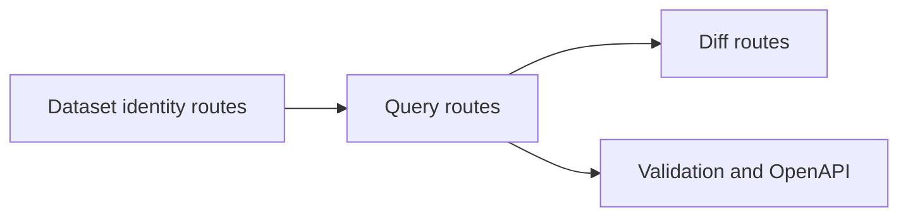

# API Endpoint Index

This page lists the main public HTTP routes exposed by the current router.

## Endpoint Families

## Public Runtime and Health Routes

- `/`
- `/health`
- `/healthz`
- `/healthz/overload`
- `/ready`
- `/readyz`
- `/live`
- `/metrics`

## Public API Routes

- `/v1/openapi.json`
- `/v1/version`
- `/v1/datasets`
- `/v1/datasets/{release}/{species}/{assembly}`
- `/v1/releases/{release}/species/{species}/assemblies/{assembly}`
- `/v1/genes`
- `/v1/genes/count`
- `/v1/query/validate`
- `/v1/diff/genes`
- `/v1/diff/region`
- `/v1/sequence/region`
- `/v1/genes/{gene_id}/sequence`
- `/v1/genes/{gene_id}/transcripts`
- `/v1/transcripts/{tx_id}`

## Debug Routes

Additional `/debug/...` routes may be enabled depending on runtime settings. Treat them as operationally sensitive and configuration-dependent rather than universal public surface.

