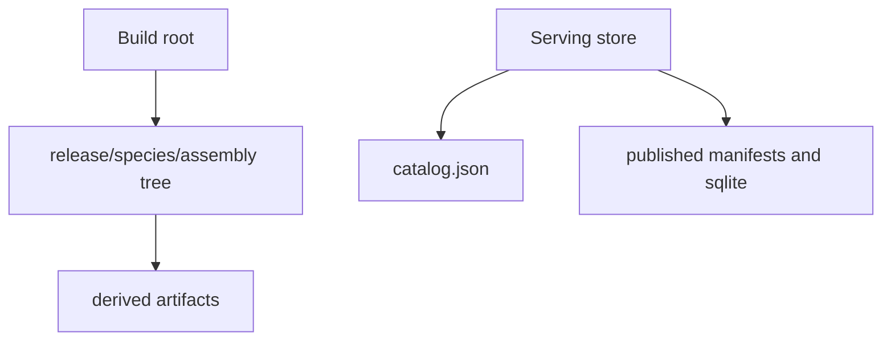
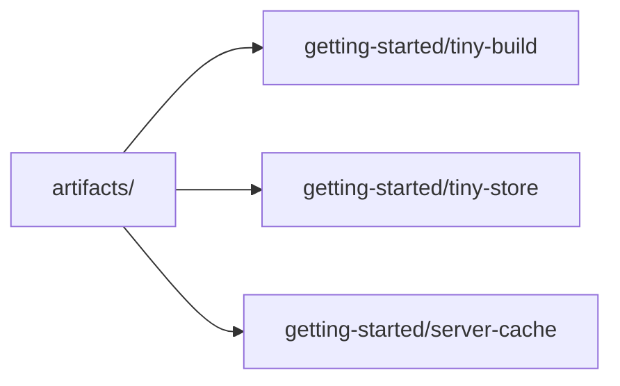

# Artifact Layout

Atlas artifact layout matters because many workflows depend on the difference between build roots, serving stores, and transient cache state.

## Layout Model

This layout model shows the two durable Atlas storage shapes readers most often confuse: the ingest
build root and the serving store. The reference page keeps that distinction visible.

## Example Layout Ideas

This example layout is not a contract for every path name, but it is the canonical pattern the docs
use when showing build, store, and cache locations in the repository workspace.

## Key Distinctions

- build roots hold ingest outputs and verification targets
- serving stores hold published artifacts and catalog state
- cache roots hold transient performance state

## Operational Rule

Do not let crate-local scratch directories become artifact roots. Keep artifact and cache state under the repository artifacts area.

## Purpose

This page is the lookup reference for artifact layout. Use it when you need the current checked-in surface quickly and without extra narrative.

## Stability

This page is a checked-in reference surface. Keep it synchronized with the repository state and generated evidence it summarizes.
