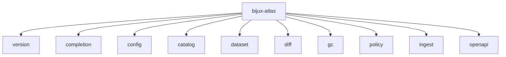
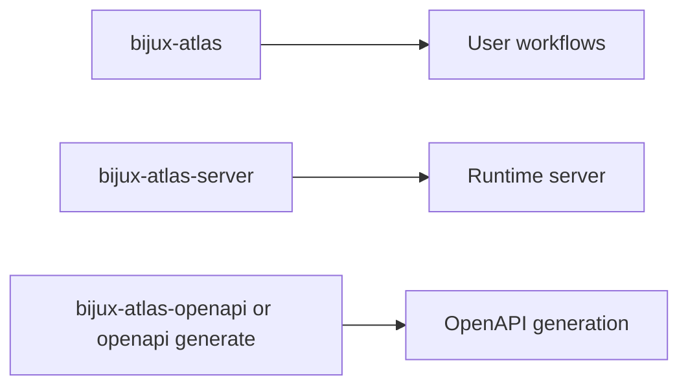

# Command Surface

This page summarizes the user-facing Atlas command families. It does not document the maintainer control plane; that lives in [Automation Command Surface](automation-command-surface.md).

## Top-Level Command Map

## Runtime Companions

Use this page when you are asking, "Which runtime-facing binary or subcommand family should I use?"

Use the automation reference when you are asking, "Which maintainer command checks the repository, docs, or release state?"

## Top-Level Families

- `version`: print CLI version information
- `completion`: generate shell completions
- `config`: inspect config behavior
- `catalog`: validate and mutate catalog state
- `dataset`: validate, verify, publish, and pack dataset state
- `diff`: build dataset diff artifacts
- `gc`: plan and apply garbage collection
- `policy`: validate and explain active policy
- `ingest`: build validated dataset state from source inputs
- `openapi`: generate the OpenAPI description

## Stability Reading

- `bijux-atlas`, `bijux-atlas-server`, and documented command families are user-facing surfaces
- structured output, error behavior, and OpenAPI are only as stable as the documented contracts behind them
- debug-only or maintainer-only commands should not be inferred from this page

## Related Binaries

- `bijux-atlas`
- `bijux-atlas-server`
- `bijux-atlas-openapi`
