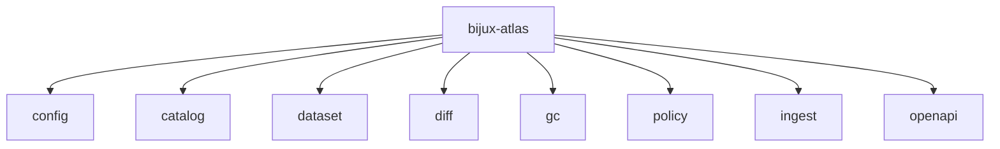
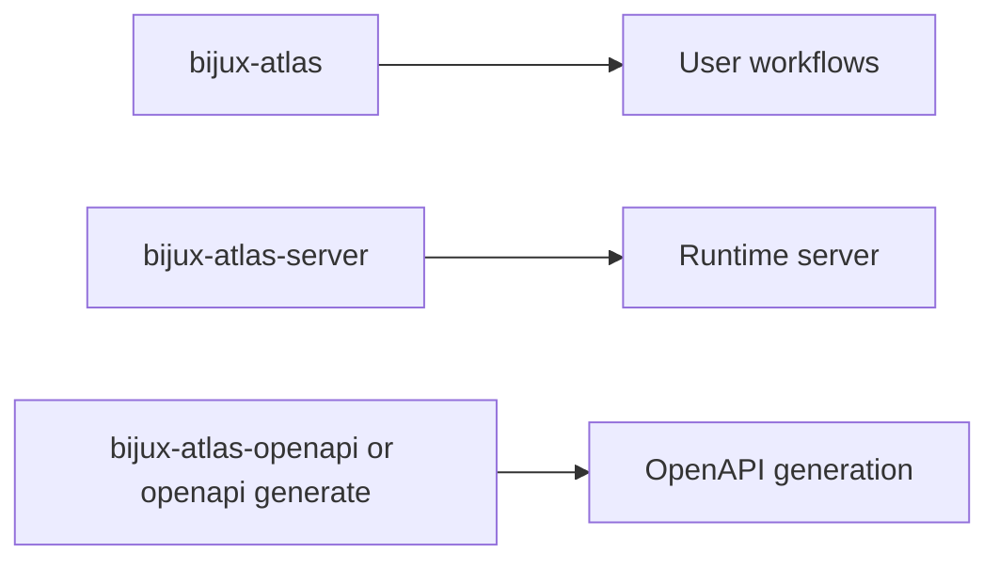

# Command Surface

This page summarizes the top-level Atlas command families.

## Top-Level Command Map

## Runtime Companions

## Top-Level Families

- `config`: inspect config behavior
- `catalog`: validate and mutate catalog state
- `dataset`: validate, verify, publish, and pack dataset state
- `diff`: build dataset diff artifacts
- `gc`: plan and apply garbage collection
- `policy`: validate and explain active policy
- `ingest`: build validated dataset state from source inputs
- `openapi`: generate the OpenAPI description

## Related Binaries

- `bijux-atlas`
- `bijux-atlas-server`
- `bijux-atlas-openapi`

