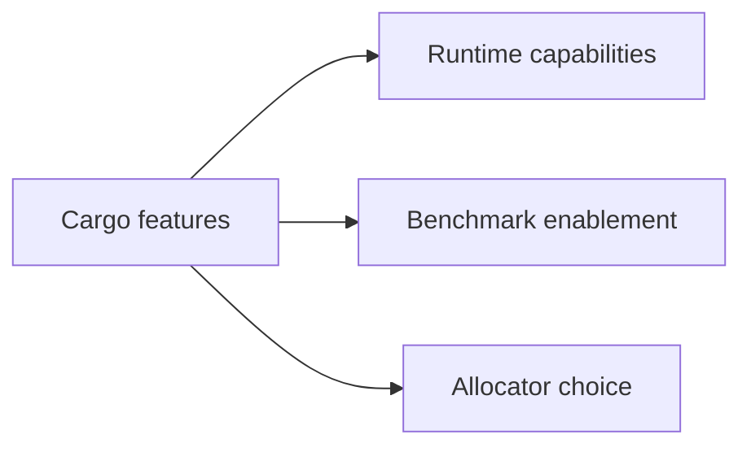
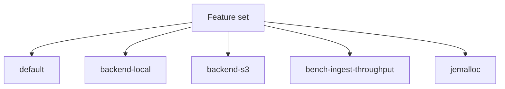

# Feature Flags

This page summarizes the notable Cargo feature flags in the current `bijux-atlas` crate.

## Feature Flag Groups

This feature-group diagram shows why Cargo features belong in reference rather than runtime
configuration docs. They are build-time capability switches, not live server knobs.

## Current Features

This current-feature map gives a fast inventory of the notable compile-time switches in the crate.

## Feature Summary

- `default`
- `serde`
- `backend-local`
- `backend-s3`
- `bench-ingest-throughput`
- `jemalloc`

## Reading Guidance

Treat feature flags as build-time capability switches. Do not confuse them with runtime configuration flags.

## Purpose

This page is the lookup reference for feature flags. Use it when you need the current checked-in surface quickly and without extra narrative.

## Stability

This page is a checked-in reference surface. Keep it synchronized with the repository state and generated evidence it summarizes.
