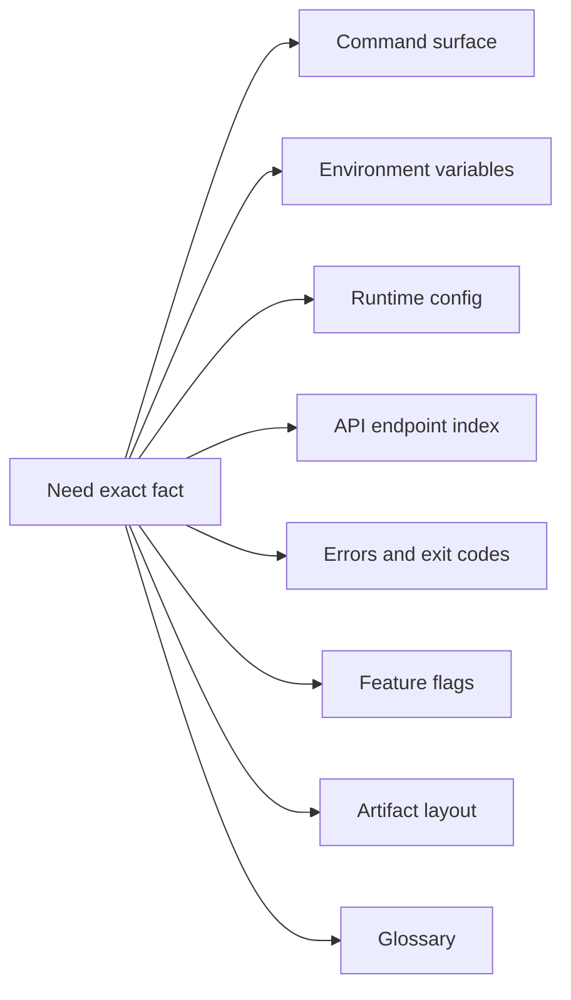
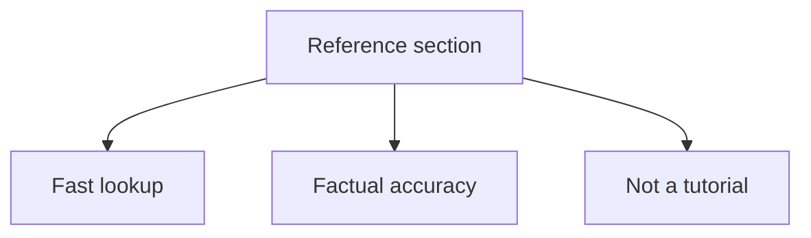

# Bijux Atlas Reference

Use this section when you already know what you are trying to do and need a factual lookup page.

This lookup map exists so readers can move directly from a factual question to the right reference
page. Reference pages are meant to shorten confirmation work, not add more narrative.

This diagram makes the section boundary explicit. If you need step-by-step guidance, move back to
getting-started, user-guide, or operations pages instead of expecting the reference section to teach
workflow.

## Pages in This Section

- [Command Surface](command-surface.md)
- [Automation Command Surface](automation-command-surface.md)
- [Automation Reports Reference](automation-reports-reference.md)
- [Environment Variables](environment-variables.md)
- [Runtime Config Reference](runtime-config-reference.md)
- [API Endpoint Index](api-endpoint-index.md)
- [Error Codes and Exit Codes](error-codes-and-exit-codes.md)
- [Feature Flags](feature-flags.md)
- [Artifact Layout](artifact-layout.md)
- [Glossary](glossary.md)

## Purpose

This page is the lookup reference for reference. Use it when you need the current checked-in surface quickly and without extra narrative.

## What to Expect Here

- exact names, keys, paths, and identifiers
- cross-links into generated evidence where helpful
- less tutorial prose and more stable factual lookup

## Stability

This page is a checked-in reference surface. Keep it synchronized with the repository state and generated evidence it summarizes.
