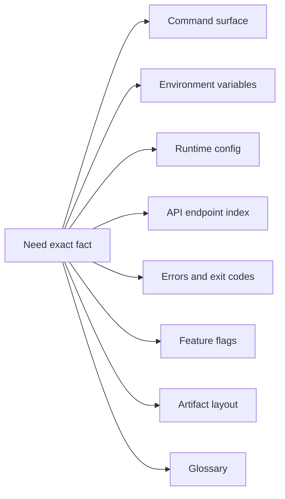
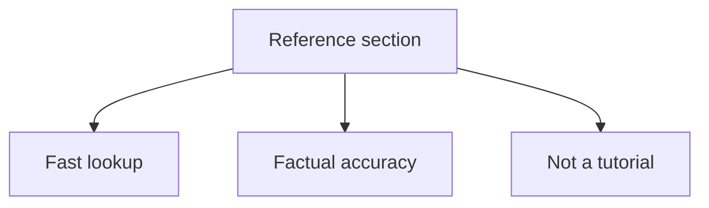

# Reference

Use this section when you already know what you are trying to do and need a factual lookup page.

## Pages in This Section

- [Command Surface](command-surface.md)
- [Environment Variables](environment-variables.md)
- [Runtime Config Reference](runtime-config-reference.md)
- [API Endpoint Index](api-endpoint-index.md)
- [Error Codes and Exit Codes](error-codes-and-exit-codes.md)
- [Feature Flags](feature-flags.md)
- [Artifact Layout](artifact-layout.md)
- [Glossary](glossary.md)

