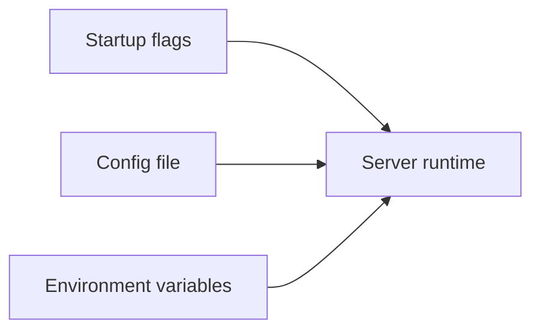
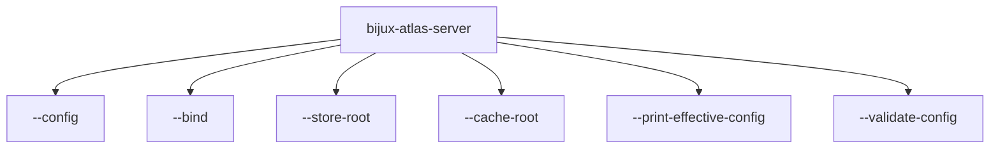

# Runtime Config Reference

This page summarizes the most visible runtime configuration entrypoints for the server binary.

## Runtime Config Inputs

## Visible Server Flags

## Key Flags

- `--config`: explicit config file input
- `--bind`: network bind address
- `--store-root`: serving store root
- `--cache-root`: runtime cache root
- `--print-effective-config`: inspect resolved runtime config
- `--validate-config`: validate runtime config without normal startup

## Key Rule

`--store-root` should point at a serving store with published artifacts and catalog state, not at an ingest build root.

## Purpose

This page is the lookup reference for runtime config reference. Use it when you need the current checked-in surface quickly and without extra narrative.

## Stability

This page is a checked-in reference surface. Keep it synchronized with the repository state and generated evidence it summarizes.
