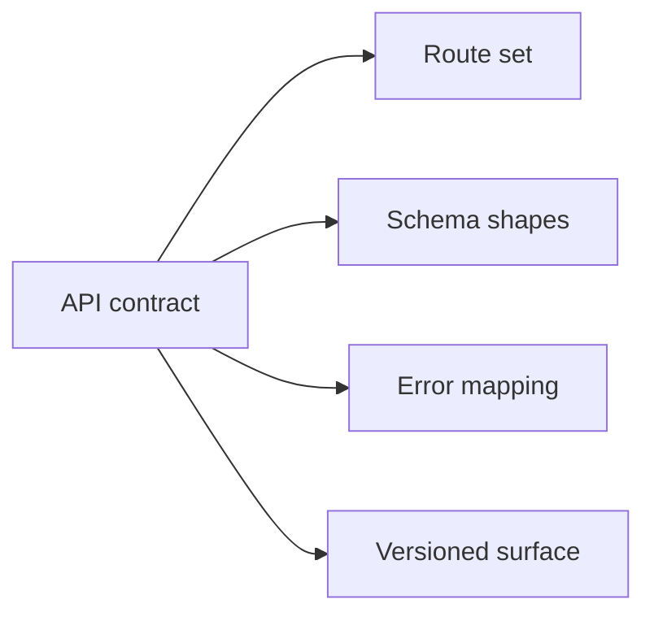
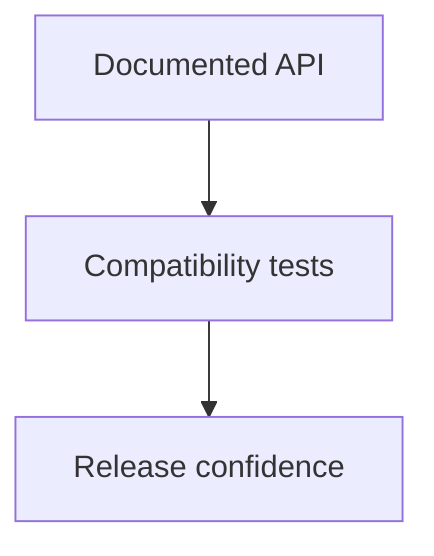

# API Compatibility

API compatibility defines what HTTP clients can reasonably rely on across Atlas changes.

## Compatibility Scope

This compatibility-scope diagram names the parts of the HTTP surface Atlas expects clients to rely
on intentionally. It is the contract boundary for API evolution decisions.

## Compatibility Model

This model explains how API compatibility should be justified: documented surface plus tests plus
release confidence, not only implementation intent.

## Main Promise Areas

- route availability and naming
- structured response shape
- documented error code behavior
- OpenAPI representation of the stable surface

## Non-Promise Areas

- undocumented debug routes
- incidental implementation details behind handlers

## Purpose

This page defines the Atlas contract expectations for api compatibility. Use it when you need the explicit compatibility promise rather than a workflow narrative.

## Stability

This page is part of the checked-in contract surface. Changes here should stay aligned with tests, generated artifacts, and release evidence.
