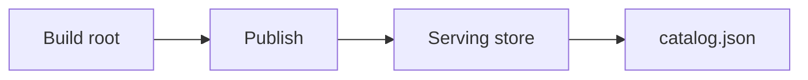
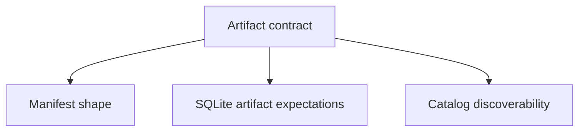

# Artifact and Store Contracts

Artifact and store contracts define how durable dataset state is shaped and what the runtime expects to discover.

## Contracted Storage Shape

## Contract Focus

## Main Promise

Atlas should make the durable serving shape explicit enough that publication, serving, backup, and recovery can all reason about the same artifact model.

