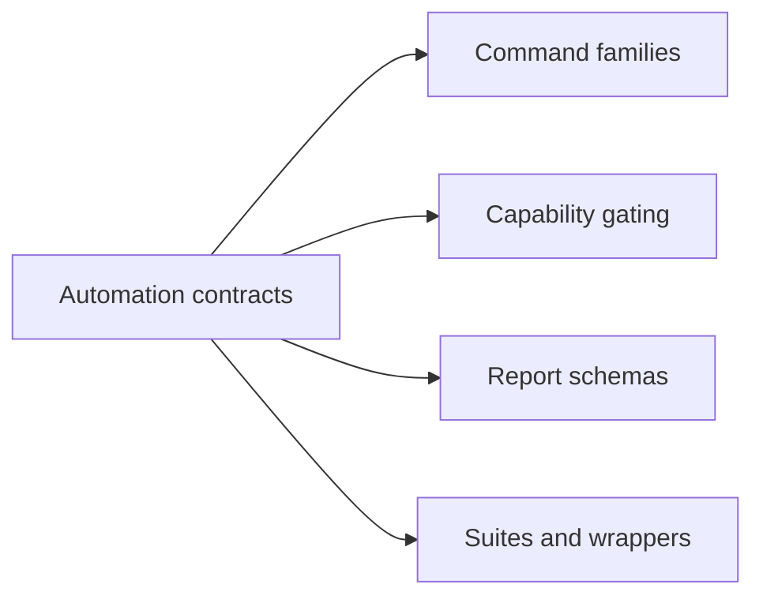

# Automation Contracts

This page defines the stable promises around the Atlas development control plane, especially `bijux-dev-atlas`, suite execution, and governed report artifacts.

## Contract Scope

## Main Promises

- repository automation remains discoverable through `bijux-dev-atlas` and documented wrapper entrypoints
- effectful commands fail closed when required capabilities are not explicitly allowed
- governed reports use versioned JSON schemas under `configs/schemas/contracts/reports/`
- suite and check execution expose explicit selection inputs instead of hidden lane behavior
- structured consumers can rely on documented report fields more than terminal formatting

## Report Schema Promise

For governed report families, the shared report contract includes:

- `report_id`
- `version`
- `inputs`
- `summary`
- `evidence`

Report-specific fields may evolve, but breaking schema changes require a version bump and matching documentation, schema, and fixture updates.

## Compatibility Rules

- additive fields should be safe for tolerant consumers
- breaking report changes require explicit schema-version change
- wrapper commands such as `make ci-pr` and `make docs-build` should remain thin public entrypoints over the documented control-plane surface
- lane selection must stay explicit enough that contributors can reproduce CI behavior locally

## Non-Promise Areas

These details may change without becoming compatibility commitments:

- internal crate module names
- the exact number of runnables registered in a domain
- human-readable terminal phrasing that is not part of a documented report contract
- internal refactors that preserve command behavior, schema contracts, and documented wrappers

## Related Pages

- [Automation Command Surface](../07-reference/automation-command-surface.md)
- [Automation Reports Reference](../07-reference/automation-reports-reference.md)
- [Ownership and Versioning](ownership-and-versioning.md)
