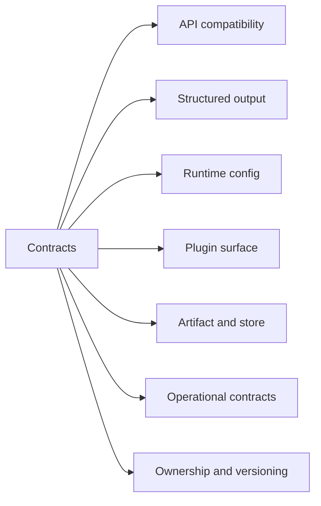
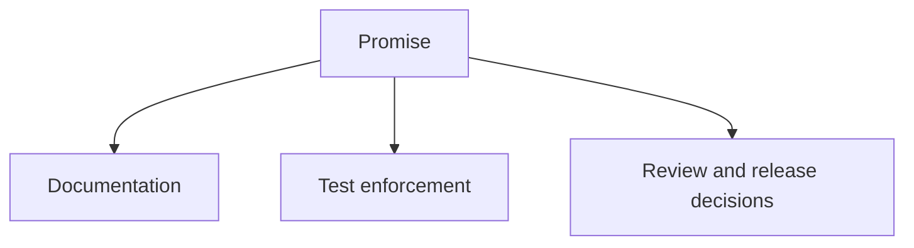

# Bijux Atlas Contracts

This section describes the stable promises Atlas intentionally makes.

This map names the stable promises Atlas chooses to publish. A page belongs in this section only
when it describes behavior that reviewers, operators, or downstream users are expected to rely on.

This diagram explains how Atlas treats a contract: it is not just prose. A contract should connect
to test enforcement and release decisions so the promise remains credible over time.

## Pages in This Section

- [API Compatibility](api-compatibility.md)
- [Automation Contracts](automation-contracts.md)
- [Structured Output Contracts](structured-output-contracts.md)
- [Runtime Config Contracts](runtime-config-contracts.md)
- [Plugin Contracts](plugin-contracts.md)
- [Artifact and Store Contracts](artifact-and-store-contracts.md)
- [Operational Contracts](operational-contracts.md)
- [Ownership and Versioning](ownership-and-versioning.md)

## Purpose

This page defines the Atlas contract expectations for contracts. Use it when you need the explicit compatibility promise rather than a workflow narrative.

## When to Reach for This Section

- a change might alter a documented compatibility promise
- you need to know whether a behavior is intentionally stable
- a release, review, or downstream integration decision depends on a clear promise

## Stability

This page is part of the checked-in contract surface. Changes here should stay aligned with tests, generated artifacts, and release evidence.
