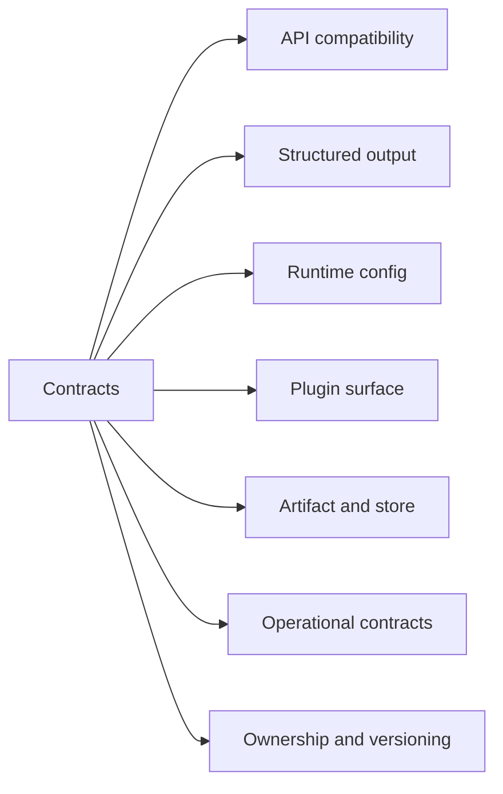
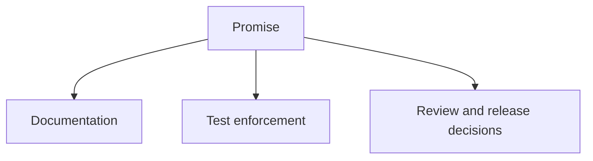

# Contracts

This section describes the stable promises Atlas intentionally makes.

## Pages in This Section

- [API Compatibility](api-compatibility.md)
- [Automation Contracts](automation-contracts.md)
- [Structured Output Contracts](structured-output-contracts.md)
- [Runtime Config Contracts](runtime-config-contracts.md)
- [Plugin Contracts](plugin-contracts.md)
- [Artifact and Store Contracts](artifact-and-store-contracts.md)
- [Operational Contracts](operational-contracts.md)
- [Ownership and Versioning](ownership-and-versioning.md)
