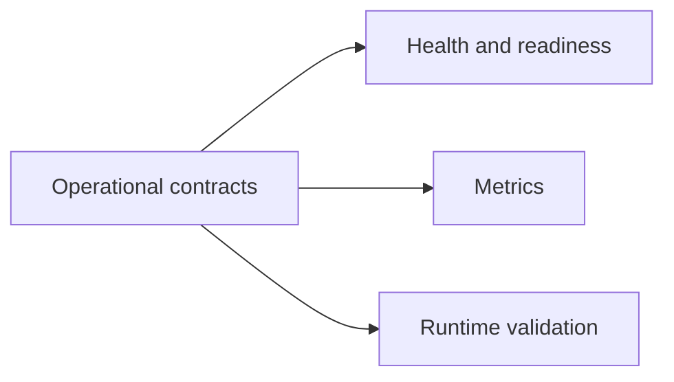
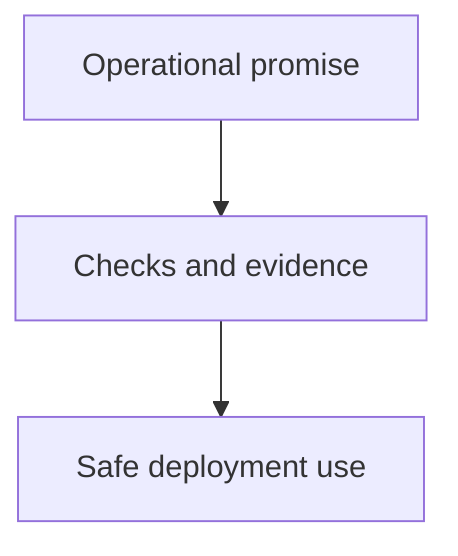

# Operational Contracts

Operational contracts define the stable expectations operators can rely on around health, readiness, observability, and runtime behavior.

## Operational Contract Scope

## Operator Promise Model

## Main Promise Areas

- health and readiness semantics
- metrics and observability surfaces
- runtime validation behavior
- explicit operator-visible error conditions

