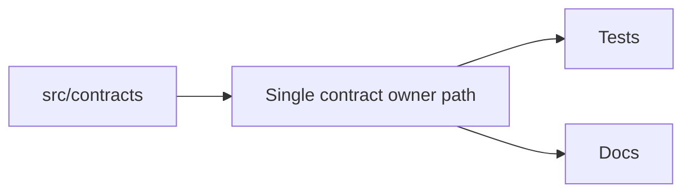
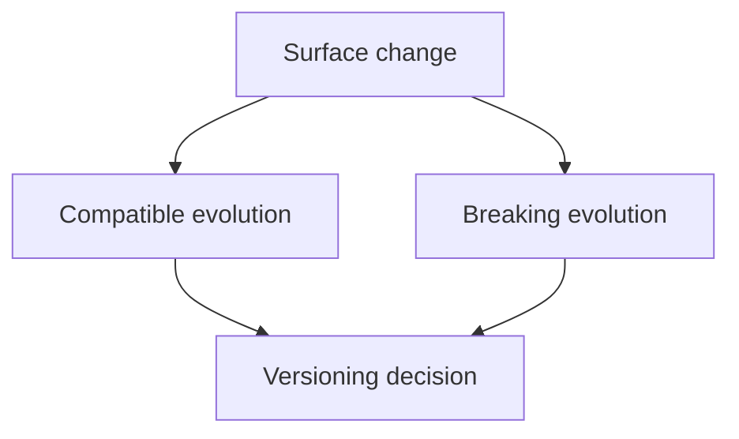

# Ownership and Versioning

Ownership and versioning contracts explain how Atlas keeps stable promises tied to one obvious owner path and evolves them intentionally.

## Ownership Model

## Versioning Logic

## Main Promise

Atlas should not hide stable truth behind multiple competing roots. If a contract is real, it should have one obvious owner and an intentional versioning story.

