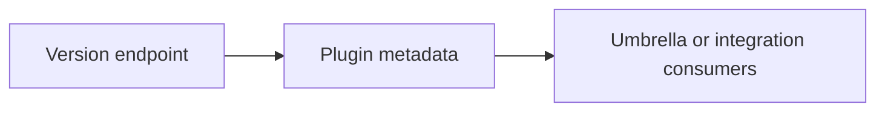
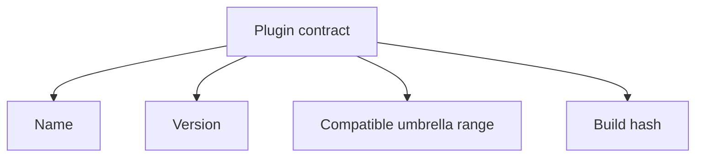

# Plugin Contracts

Plugin contracts define the metadata and compatibility information Atlas exposes for integration-aware consumers.

## Plugin Metadata Model

## Contract Focus

## Main Promise

Atlas should expose plugin identity and compatibility metadata in a form that external integrators can reason about without reading internal source code.

## Purpose

This page defines the Atlas contract expectations for plugin contracts. Use it when you need the explicit compatibility promise rather than a workflow narrative.

## Stability

This page is part of the checked-in contract surface. Changes here should stay aligned with tests, generated artifacts, and release evidence.
