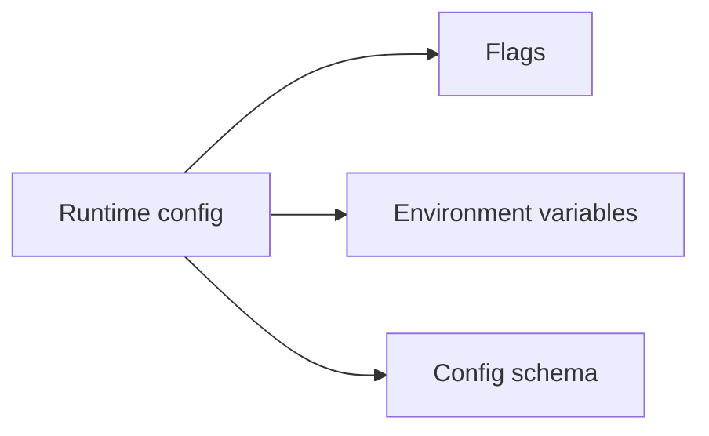
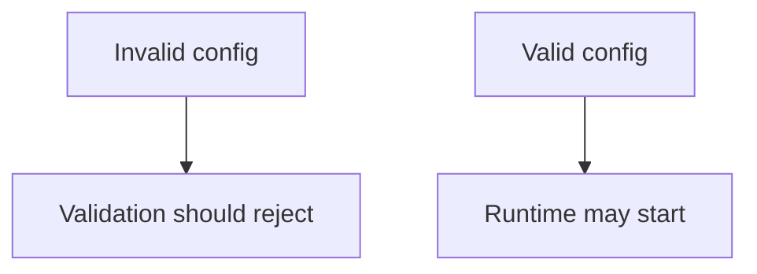

# Runtime Config Contracts

Runtime config contracts define the stable expectations around server configuration inputs and validation behavior.

## Runtime Config Contract Scope

## Contract Logic

## Main Promise

Atlas should validate explicit runtime configuration rather than silently accepting malformed or contradictory input.

