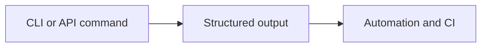
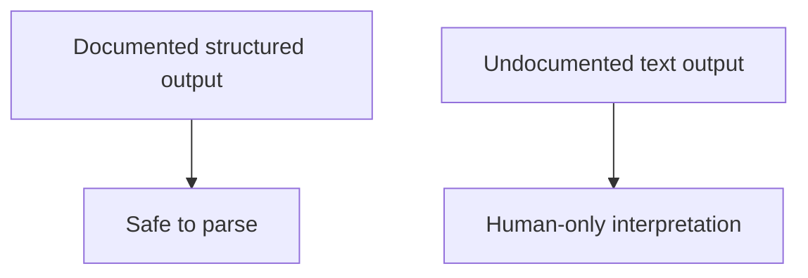

# Structured Output Contracts

Structured output contracts define which machine-readable outputs are meant to be stable enough for automation.

## Output Contract Model

## Stability Logic

## Main Promise

If Atlas documents a structured output surface and tests it, automation should prefer that surface over screen-scraped human text.

## Stability

Only structured outputs that Atlas documents as contracts should be treated as
stable automation inputs. Human-readable text remains descriptive and may
change without compatibility guarantees.

## Purpose

This page defines the Atlas contract expectations for structured output contracts. Use it when you need the explicit compatibility promise rather than a workflow narrative.
